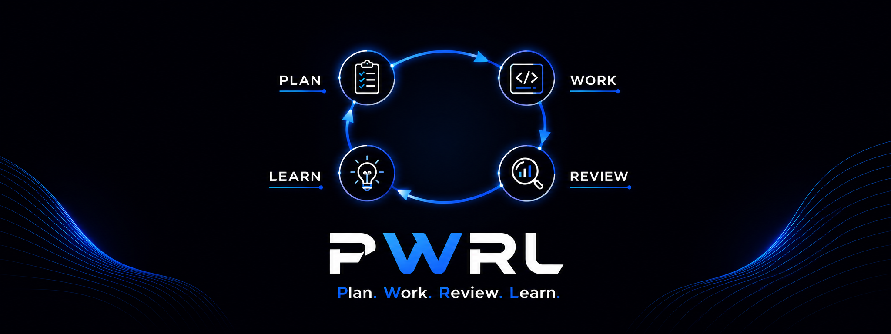

**Plan. Work. Review. Learn.** — A disciplined agentic development framework.

Stop vibing, start shipping. PWRL turns chaotic AI-assisted coding into predictable, high-quality software delivery.

---

## Quick Start

```bash
# Install
npm install -g @wicttor/pwrl

# Initialize in your project (interactive setup)
pwrl init

# Skills will be copied to .agents/skills/ (or your custom location)
# Agents will be copied to .agents/agents/ (orchestrators)
# Configuration saved in .pwrlrc.json

# Use in your AI assistant
/pwrl-plan
/pwrl-work
/pwrl-review
/pwrl-learnings
/pwrl-update-learnings
/pwrl-end-session
```

**Result:** Complete, tested, documented feature with clean commit.

---

## Why PWRL?

| Vibe Coding 😵‍💫             | PWRL ✅                      |
| -------------------------- | ---------------------------- |
| Incomplete implementations | Complete features with tests |
| Hidden technical debt      | Systematic execution         |
| Lost context               | Persistent knowledge capture |
| Scope creep                | Clear boundaries & plans     |

---

## Core Skills

| Skill                         | Purpose                           | When to Use                |
| ----------------------------- | --------------------------------- | -------------------------- |
| **`/pwrl-plan`**              | Create implementation plans       | Before non-trivial work    |
| **`/pwrl-tasks`**             | Slice plans into executable tasks | After planning, optional   |
| **`/pwrl-work`**              | Execute with orchestrated phases  | Implement features/fixes   |
| **`/pwrl-review`**            | Code quality checks               | After work, before merge   |
| **`/pwrl-learnings`**         | Document solutions                | After solving problems     |
| **`/pwrl-refresh-learnings`** | Maintain knowledge                | After refactors, quarterly |
| **`/pwrl-update-learnings`**  | Sync learnings index              | After session commit       |
| **`/pwrl-end-session`**       | Clean commits                     | End of every session       |

### Agent-Orchestrated Workflows (Internal)

When agents are enabled, PWRL uses agents to orchestrate multi-phase workflows with user feedback at each checkpoint.

#### Planning Agent: `/pwrl-plan`

Delegates to the **PWRL Planner Agent**, which orchestrates four micro-skills in sequence:

| Micro-Skill              | Phase | Purpose                                   |
| ------------------------ | ----- | ----------------------------------------- |
| **`pwrl-plan-scope`**    | S1    | Gather context, validate domain           |
| **`pwrl-plan-research`** | S2    | Discover patterns, detect high-risk areas |
| **`pwrl-plan-design`**   | S3    | Decompose into implementation units       |
| **`pwrl-plan-generate`** | S4    | Select tier, render plan, save to docs    |

#### Work Agent: `/pwrl-work`

Delegates to the **PWRL Work Agent**, which orchestrates five micro-skills in sequence:

| Micro-Skill             | Phase | Purpose                                    |
| ----------------------- | ----- | ------------------------------------------ |
| **`pwrl-work-triage`**  | W1    | Classify input and extract context         |
| **`pwrl-work-prepare`** | W2    | Set up environment and create task lists   |
| **`pwrl-work-execute`** | W3    | Implement tasks (inline, serial, parallel) |
| **`pwrl-work-review`**  | W4    | Simplify code and consolidate changes      |
| **`pwrl-work-ship`**    | W5    | Finalize, approve, and commit work         |

**How it works:**

- **With Agents Enabled:** `/pwrl-plan [task]` or `/pwrl-work [file]` → Agent orchestrates phases automatically, collecting user approval at each checkpoint
- **Without Agents (Fallback):** Runs all phases inline within the main workflow

**Setup:** See [INSTALLATION.md](INSTALLATION.md#agent-setup) for enabling agents on your platform.

**Note:** Micro-skills can also be called directly (e.g., `/pwrl-plan-scope`) if agents are unavailable or you need fine-grained control. However, most users invoke `/pwrl-plan` and `/pwrl-work` only, with agent routing happening automatically.

---

## Workflow


**Agent-Orchestrated (Recommended):**
```
/pwrl-plan
  ├─ pwrl-plan-scope → pwrl-plan-research → pwrl-plan-design → pwrl-plan-generate
  └─ Output: docs/plans/YYYY-MM-DD-NNN-<name>.md

/pwrl-work
  ├─ pwrl-work-triage → pwrl-work-prepare → pwrl-work-execute → pwrl-work-review → pwrl-work-ship
  └─ Output: Committed code with status updates

Optional: /pwrl-review (for explicit review before merge)
/pwrl-learnings
/pwrl-end-session
```

**Without Agents (Fallback):** All phases run inline within `/pwrl-plan` and `/pwrl-work` automatically.

**Task Status Flow:** `to-do` → `in-progress` → `for-review` → `done`

**Optional:** Use `/pwrl-tasks` to break plans into granular task files with GitHub Issues integration.

---

## Configuration

After running `pwrl init`, your project settings are stored in `.pwrlrc.json`:

- **Skills location**: Where PWRL skills are installed (default: `.agents/skills/`)
- **GitHub Issues integration**: Enable automatic task tracking with GitHub Issues

You can reconfigure at any time by running `pwrl init` again or editing `.pwrlrc.json` manually.

---

## Documentation

- **[INSTALLATION.md](INSTALLATION.md)** — Setup for GitHub Copilot, Claude, Cursor, Gemini, Pi Agent
- **[QUICKSTART.md](QUICKSTART.md)** — Example workflows and common tasks
- **[GUIDE.md](GUIDE.md)** — Best practices, anti-patterns, philosophy
- **[CONTRIBUTING.md](CONTRIBUTING.md)** — How to contribute new skills

### For Contributors

- **[pwrl-standards/SCHEMA.md](pwrl-standards/SCHEMA.md)** — Canonical standardized format for pwrl-\* skills
- **[pwrl-standards/TEMPLATE.md](pwrl-standards/TEMPLATE.md)** — Unified skill template with examples
- **[pwrl-standards/AUDIT.md](pwrl-standards/AUDIT.md)** — Standardization audit and migration analysis

---

## Example: Feature Development

### Option 1: Direct Plan-to-Work (Simple)

```bash
# 1. Plan
/pwrl-plan Add JWT authentication with refresh tokens

# 2. Work - Execute with orchestrated phases
/pwrl-work
# Automatically runs: triage → prepare → execute → review → ship

# 3. Document and commit
/pwrl-learnings
/pwrl-end-session
```

### Option 2: Task-Based (Complex/Team)

```bash
# 1. Plan
/pwrl-plan Add JWT authentication with refresh tokens
# Creates docs/plans/2026-05-04-jwt-auth.md with:
# - Technical decisions (JWT vs sessions, with rationale)
# - Implementation units (U1: models, U2: middleware, U3: endpoints)
# - Test scenarios (happy path + edge cases)
# - Risk analysis

# 2. Create Tasks (Optional)
/pwrl-tasks docs/plans/2026-05-04-jwt-auth.md
# Creates granular task files in docs/tasks/to-do/:
# - 2026-05-04-u1-add-user-model.md
# - 2026-05-04-u2-auth-middleware.md
# - 2026-05-04-u3-auth-endpoints.md
# If GitHub integration enabled: creates issues for each task

# 3. Work on First Task
/pwrl-work docs/tasks/to-do/2026-05-04-u1-add-user-model.md
# Executes orchestrated workflow:
# - Triage: Classify task context
# - Prepare: Set up environment, create subtasks
# - Execute: Implement with tests (inline, serial, or parallel)
# - Review: Simplify and consolidate changes
# - Ship: Finalize and commit
# - GitHub: Updates issue status if integration enabled

# 4. Continue with Remaining Tasks
/pwrl-work docs/tasks/to-do/2026-05-04-u2-auth-middleware.md
/pwrl-work docs/tasks/to-do/2026-05-04-u3-auth-endpoints.md
# Repeat workflow for each unit

# 5. Learn & Commit
/pwrl-learnings
# Documents in docs/learnings/:
# - JWT token refresh pattern learned
# - Auth middleware gotcha avoided
# - Test strategy for async auth flows

/pwrl-end-session
# Creates clean commit with all tasks completed
```

**Time saved vs vibe coding:** ~50%
**Quality improvement:** Measurable

---

## Installation

```bash
# Global (recommended)
npm install -g @wicttor/pwrl
pwrl init

# Per-project
cd your-project
npm install --save-dev @wicttor/pwrl
npx @wicttor/pwrl init
# This will copy bundled skills into .agents/skills/ and agents into .agents/agents/ in your project
```

See [INSTALLATION.md](INSTALLATION.md) for platform-specific setup.

---

## CLI Commands

```bash
pwrl init      # Initialize PWRL in project
pwrl info      # Show skill locations
pwrl docs      # Show documentation paths
pwrl help      # Show CLI help
pwrl version   # Show version
```

**Note:** Skills are invoked through your AI assistant (`/pwrl-plan`, etc.), not via CLI.

---

## Platform Support

Works with any AI assistant that supports custom instructions or skills:

- ✅ **GitHub Copilot** (VS Code)
- ✅ **Claude** (Desktop/Web/Projects)
- ✅ **Cursor**
- ✅ **Gemini** (Google AI Studio)
- ✅ **Pi Agent**
- ✅ **Custom setups**

---

## Project Structure

After initialization:

```
your-project/
  .agents/
    skills/                   # PWRL skills (or custom location)
      pwrl-plan/
      pwrl-tasks/
      pwrl-work/
      pwrl-review/
      pwrl-learnings/
      ...
    agents/                   # PWRL agents (orchestrators, optional)
      pwrl-planner.agent.md
      pwrl-work.agent.md
  docs/
    plans/                    # Implementation plans
      2026-05-04-auth.md
    tasks/                    # Task files (if using task-based workflow)
      INDEX.md                # Task overview and dependencies
      to-do/                  # Ready to implement
      in-progress/            # Currently being worked
      for-review/             # Awaiting review
      done/                   # Completed and approved
    learnings/                # Knowledge base
      technical-fix/
      pattern/
      workflow/
      gotcha/
      concept/
      decision/
  .pwrlrc.json                # PWRL configuration
```

---

## Philosophy

1. **Plan First** — Explore approaches before coding
2. **Document Fresh** — Capture solutions while context is hot
3. **Ship Complete** — Tests, edge cases, quality gates
4. **Agent-Agnostic** — Skills work across any AI framework (LangChain, AutoGen, etc.)

Read [GUIDE.md](GUIDE.md) for the full philosophy and best practices.

### Skill Design

PWRL skills follow a standardized format:

- **Concise main files** (100-150 lines) for scannability
- **Support files** in `references/`, `assets/`, `examples/` for detailed content
- **Agent-agnostic language** for cross-framework compatibility
- **Consistent tone** (imperative mood, active voice) for clear execution

See [pwrl-standards/SCHEMA.md](pwrl-standards/SCHEMA.md) for the complete specification.

---

## Contributing

We welcome contributions! See [CONTRIBUTING.md](CONTRIBUTING.md) for:

- Creating new skills
- Improving workflows
- Documentation
- Examples

---

## License

MIT

---

**PWRL** — Because shipping quality code with AI should be systematic, not chaotic.

[GitHub](https://github.com/wicttor/pwrl) · [Issues](https://github.com/wicttor/pwrl/issues) · [Docs](INSTALLATION.md)
