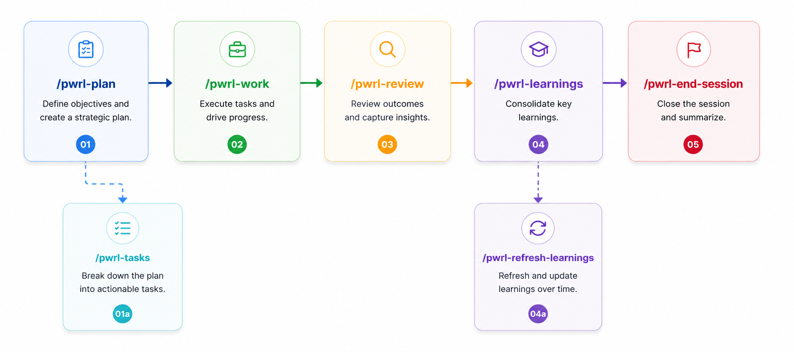

**Plan. Work. Review. Learn.** — A disciplined skill-based development framework.

Stop vibing, start shipping. PWRL turns chaotic AI-assisted coding into predictable, high-quality software delivery using composable, reusable skills.

---

## Quick Start

```bash
# Install
npm install -g @wicttor/pwrl

# Initialize in your project
pwrl init

# Skills are installed globally at ~/.agents/skills/
# Project config written to .pwrlrc.json

# Use in your AI assistant
/pwrl-plan
/pwrl-work
/pwrl-review
/pwrl-learnings
/pwrl-update-learnings
/pwrl-end-session
```

**Result:** Complete, tested, documented feature with clean commit.

---

## Why PWRL?

| Vibe Coding 😵‍💫             | PWRL ✅                      |
| -------------------------- | ---------------------------- |
| Incomplete implementations | Complete features with tests |
| Hidden technical debt      | Systematic execution         |
| Lost context               | Persistent knowledge capture |
| Scope creep                | Clear boundaries & plans     |

---

## Core Skills

| Skill                         | Purpose                           | When to Use                |
| ----------------------------- | --------------------------------- | -------------------------- |
| **`/pwrl-plan`**              | Create implementation plans       | Before non-trivial work    |
| **`/pwrl-tasks`**             | Slice plans into executable tasks | After planning, optional   |
| **`/pwrl-work`**              | Execute with orchestrated phases  | Implement features/fixes   |
| **`/pwrl-review`**            | Code quality checks               | After work, before merge   |
| **`/pwrl-learnings`**         | Document solutions                | After solving problems     |
| **`/pwrl-refresh-learnings`** | Maintain knowledge                | After refactors, quarterly |
| **`/pwrl-update-learnings`**  | Sync learnings index              | After session commit       |
| **`/pwrl-end-session`**       | Clean commits                     | End of every session       |

### Skill-Based Workflows

PWRL orchestrates work through composable skills that run in sequence:

**Planning Workflow:**

`/pwrl-plan` orchestrates four micro-skills in sequence:

| Phase | Skill                    | Purpose                                   |
| ----- | ------------------------ | ----------------------------------------- |
| 1     | **`pwrl-plan-scope`**    | Gather context, validate domain           |
| 2     | **`pwrl-plan-research`** | Discover patterns, detect high-risk areas |
| 3     | **`pwrl-plan-design`**   | Decompose into implementation units       |
| 4     | **`pwrl-plan-generate`** | Select tier, render plan, save to docs    |

**Execution Workflow:**

`/pwrl-work` orchestrates four micro-skills in sequence:

| Phase | Skill                   | Purpose                                   |
| ----- | ----------------------- | ----------------------------------------- |
| 0     | **`pwrl-work-triage`**  | Classify input and extract context        |
| 1     | **`pwrl-work-prepare`** | Set up environment, move task to progress |
| 2     | **`pwrl-work-execute`** | Implement with test-first discipline      |
| 3     | **`pwrl-work-review`**  | Code review, quality gates, move to done  |

**Review Workflow:**

`/pwrl-review` orchestrates four micro-skills in sequence:

| Phase | Skill                    | Purpose                                   |
| ----- | ------------------------ | ----------------------------------------- |
| 1     | **`pwrl-review-scope`**  | Classify input and scope review           |
| 2     | **`pwrl-review-prepare`**| Set up review environment                 |
| 3     | **`pwrl-review-analyze`**| Execute code review, find issues          |
| 4     | **`pwrl-review-report`** | Report verdict (APPROVED/CHANGES/REJECT)  |

**Learning Capture Workflow:**

`/pwrl-learnings` orchestrates five micro-skills in sequence:

| Phase | Skill                        | Purpose                                   |
| ----- | ---------------------------- | ----------------------------------------- |
| 1     | **`pwrl-learnings-extract`** | Extract patterns from work                |
| 2     | **`pwrl-learnings-classify`**| Categorize learning type                  |
| 3     | **`pwrl-learnings-dedup`**   | Check for duplicates                      |
| 4     | **`pwrl-learnings-save`**    | Save to persistent storage                |
| 5     | **`pwrl-learnings-structure`**| Update learnings INDEX                    |

**Session Finalization Workflow:**

`/pwrl-end-session` orchestrates two micro-skills in sequence:

| Phase | Skill                        | Purpose                                   |
| ----- | ---------------------------- | ----------------------------------------- |
| 1     | **`pwrl-end-session-checkpoint`** | Save checkpoint state                |
| 2     | **`pwrl-end-session-commit`**| Create clean commit with learnings        |

**How it works:**

- **Direct invocation:** `/pwrl-plan [task]` → Runs all four phases in sequence
- **Or call skills individually:** `/pwrl-plan-scope`, `/pwrl-plan-research`, etc. (for fine-grained control)
- Same with `/pwrl-work` — runs all four phases or call individual micro-skills

**All workflows run inline** — No external orchestrators needed.

---

## Workflow



**Skill Execution Flow:**

```
/pwrl-plan
  └─ Orchestrates: scope → research → design → generate
     Output: docs/plans/YYYY-MM-DD-NNN-<name>.md

/pwrl-work
  └─ Orchestrates: triage → prepare → execute → review
     Output: Feature branch ready for manual PR creation

/pwrl-review (for explicit review before PR)
  └─ Orchestrates: scope → prepare → analyze → report
     Output: Verdict (APPROVED/REQUEST CHANGES/REJECTED)

/pwrl-learnings
  └─ Orchestrates: extract → classify → dedup → save → structure
     Output: docs/learnings/YYYY-MM-DD-<category>-<title>.md

/pwrl-end-session
  └─ Orchestrates: checkpoint → commit
     Output: Clean commit with learnings captured
```

Each orchestrator runs a deterministic sequence of micro-skills, with phase-based interactions and status tracking.

**Task Status Flow:** `to-do` → `in-progress` → `for-review` (awaits PR merge)

**Optional:** Use `/pwrl-tasks` to break plans into granular task files with GitHub Issues integration.

---

## Configuration

After running `pwrl init`, your project settings are stored in `.pwrlrc.json`:

- **Skills location**: PWRL skills are always installed globally at `~/.agents/skills/`. Run `pwrl init` in any project to ensure the latest skills are available.
- **GitHub Issues integration**: Enable automatic task tracking with GitHub Issues

You can re-run `pwrl init` to refresh skills or reconfigure.

---

## Documentation

- **[INSTALLATION.md](INSTALLATION.md)** — Setup for GitHub Copilot, Claude, Cursor, Gemini, Pi Agent
- **[QUICKSTART.md](QUICKSTART.md)** — Example workflows and common tasks
- **[GUIDE.md](GUIDE.md)** — Best practices, anti-patterns, philosophy
- **[CONTRIBUTING.md](CONTRIBUTING.md)** — How to contribute new skills

### For Contributors

- **[pwrl-standards/SCHEMA.md](pwrl-standards/SCHEMA.md)** — Canonical standardized format for pwrl-\* skills
- **[pwrl-standards/TEMPLATE.md](pwrl-standards/TEMPLATE.md)** — Unified skill template with examples
- **[pwrl-standards/AUDIT.md](pwrl-standards/AUDIT.md)** — Standardization audit and migration analysis

---

## Example: Feature Development

### Option 1: Direct Plan-to-Work (Simple)

```bash
# 1. Plan
/pwrl-plan Add JWT authentication with refresh tokens

# 2. Work - Execute with orchestrated phases
/pwrl-work
# Automatically runs: triage → prepare → execute → review

# 3. Document and commit
/pwrl-learnings
/pwrl-end-session
```

### Option 2: Task-Based (Complex/Team)

```bash
# 1. Plan
/pwrl-plan Add JWT authentication with refresh tokens
# Creates docs/plans/2026-05-04-jwt-auth.md with:
# - Technical decisions (JWT vs sessions, with rationale)
# - Implementation units (U1: models, U2: middleware, U3: endpoints)
# - Test scenarios (happy path + edge cases)
# - Risk analysis

# 2. Create Tasks (Optional)
/pwrl-tasks docs/plans/2026-05-04-jwt-auth.md
# Creates granular task files in docs/tasks/to-do/:
# - 2026-05-04-u1-add-user-model.md
# - 2026-05-04-u2-auth-middleware.md
# - 2026-05-04-u3-auth-endpoints.md
# If GitHub integration enabled: creates issues for each task

# 3. Work on First Task
/pwrl-work docs/tasks/to-do/2026-05-04-u1-add-user-model.md
# Executes orchestrated workflow (choose interaction mode: Detailed or Yolo):
# - Triage: Classify task context, select interaction mode
# - Prepare: Set up environment, move task to in-progress/
# - Execute: Implement with tests, move task to for-review/
# - Review: Simplify and consolidate changes
# Task now in for-review/ awaiting explicit /pwrl-review verdict

# 4. Review and Approve Tasks
/pwrl-review
# Reviews code quality, finds issues, returns verdict:
# - APPROVED: Task approved, ready for PR
# - REQUEST CHANGES: Task needs revision, moved back to in-progress/
# - REJECTED: Task rejected, kept in for-review/

# 5. Continue with Remaining Tasks
/pwrl-work docs/tasks/to-do/2026-05-04-u2-auth-middleware.md
/pwrl-work docs/tasks/to-do/2026-05-04-u3-auth-endpoints.md
# Repeat workflow for each unit

# 6. Create Pull Request
# When all tasks are approved:
git push origin feature-branch
# Open PR via GitHub or `gh pr create`

# 7. Learn & Commit
/pwrl-learnings
# Documents in docs/learnings/:
# - JWT token refresh pattern learned
# - Auth middleware gotcha avoided
# - Test strategy for async auth flows

/pwrl-end-session
# Creates clean commit with learnings captured
```

**Time saved vs vibe coding:** ~50%
**Quality improvement:** Measurable

---

## Installation

```bash
# Global (recommended)
npm install -g @wicttor/pwrl
pwrl init
```

See [INSTALLATION.md](INSTALLATION.md) for platform-specific setup.

---

## CLI Commands

```bash
pwrl init      # Initialize PWRL in project
pwrl info      # Show skill locations
pwrl docs      # Show documentation paths
pwrl help      # Show CLI help
pwrl version   # Show version
```

**Note:** Skills are invoked through your AI assistant (`/pwrl-plan`, etc.), not via CLI.

---

## Platform Support

Works with any AI assistant that supports custom instructions or skills:

- ✅ **GitHub Copilot** (VS Code)
- ✅ **Claude** (Desktop/Web/Projects)
- ✅ **Cursor**
- ✅ **Gemini** (Google AI Studio)
- ✅ **Pi Agent**
- ✅ **Custom setups**

---

## Project Structure

After initialization:

> **Note:** PWRL skills are installed globally at `~/.agents/skills/`, not in your project directory.

```
your-project/
  docs/
    plans/                    # Implementation plans
      2026-05-04-auth.md
    tasks/                    # Task files (if using task-based workflow)
      INDEX.md                # Task overview and dependencies
      to-do/                  # Ready to implement
      in-progress/            # Currently being worked
      for-review/             # Awaiting code review
      done/                   # Approved by /pwrl-review, ready for PR
    learnings/                # Knowledge base
      technical-fix/
      pattern/
      workflow/
      gotcha/
      concept/
      decision/
  .pwrlrc.json                # PWRL configuration
```

---

## Philosophy

1. **Plan First** — Explore approaches before coding
2. **Document Fresh** — Capture solutions while context is hot
3. **Ship Complete** — Tests, edge cases, quality gates
4. **Agent-Agnostic** — Skills work across any AI framework (LangChain, AutoGen, etc.)

Read [GUIDE.md](GUIDE.md) for the full philosophy and best practices.

### Skill Design

PWRL skills follow a standardized format:

- **Concise main files** (100-150 lines) for scannability
- **Support files** in `references/`, `assets/`, `examples/` for detailed content
- **Agent-agnostic language** for cross-framework compatibility
- **Consistent tone** (imperative mood, active voice) for clear execution

See [pwrl-standards/SCHEMA.md](pwrl-standards/SCHEMA.md) for the complete specification.

---

## Contributing

We welcome contributions! See [CONTRIBUTING.md](CONTRIBUTING.md) for:

- Creating new skills
- Improving workflows
- Documentation
- Examples

---

## License

MIT

---

**PWRL** — Because shipping quality code with AI should be systematic, not chaotic.

[GitHub](https://github.com/wicttor/pwrl) · [Issues](https://github.com/wicttor/pwrl/issues) · [Docs](INSTALLATION.md)
