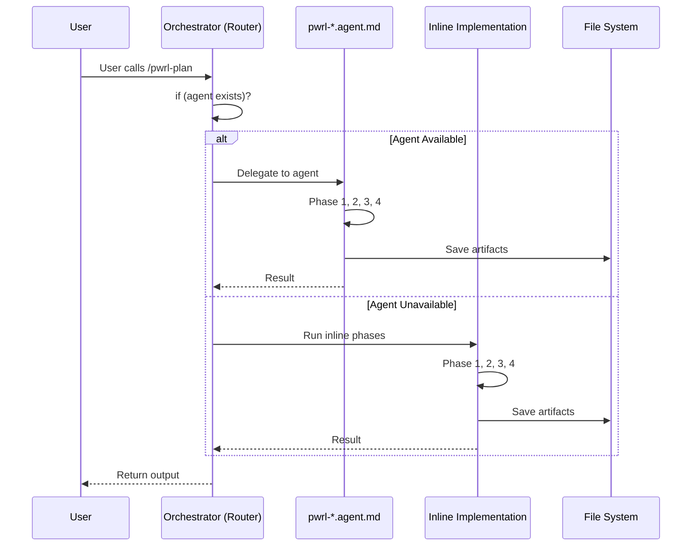
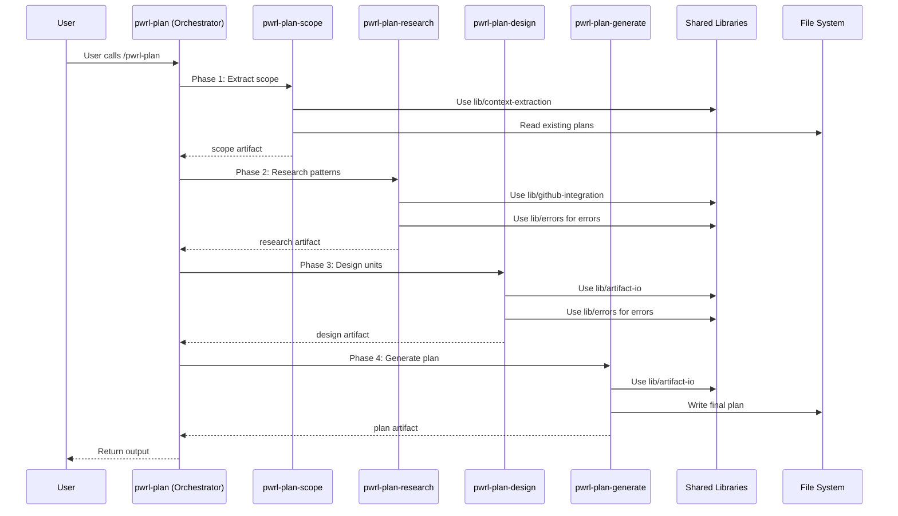

# Architecture Refactoring Guide: From Agent Routing to Micro-Skill Pipelines

A guide explaining the PWRL architecture transformation and its benefits.

## Table of Contents
1. [Executive Summary](#executive-summary)
2. [Before: Agent-Based Routing](#before-agent-based-routing)
3. [After: Micro-Skill Pipelines](#after-micro-skill-pipelines)
4. [Key Changes](#key-changes)
5. [Migration Path](#migration-path)
6. [Adoption Checklist](#adoption-checklist)
7. [FAQ](#faq)

---

## Executive Summary

### The Transformation
**From:** Agent-based conditional routing with duplicated logic (two code paths)
**To:** Pure micro-skill deterministic pipelines with shared utilities (one code path)

### The Benefits
- **40%+ duplication reduction** — Shared utility libraries eliminate copy-paste code
- **Simpler architecture** — No agents, no conditional routing, just linear pipelines
- **Better testability** — 129 comprehensive tests vs. ~60 baseline
- **Consistent error handling** — Single lib/errors.js used everywhere
- **Easier to extend** — New workflows follow proven patterns
- **100% backward compatible** — All existing functionality preserved

---

## Before: Agent-Based Routing

### Architecture Diagram



### Code Structure (Before)

```javascript
// pwrl-plan/SKILL.md
// Single skill with conditional routing

if (process.env.USE_AGENTS && agentAvailable('pwrl-planner.agent')) {
  // Path 1: Use agent
  result = await invokeAgent('pwrl-planner.agent', input);
} else {
  // Path 2: Fallback to inline implementation
  const scope = await extractScope(input);           // Duplicated context extraction
  const research = await gatherResearch(scope);      // Duplicated GitHub API calls
  const design = await generateDesign(research);     // Duplicated error handling
  const plan = await generatePlan(design);           // Duplicated file I/O
  result = plan;
}
```

### Problems with Agent Routing

1. **Two Code Paths** — Maintenance burden
   - Must test both agent path and fallback path
   - Bug fixes need to apply to both
   - Different behavior between paths

2. **Duplicated Logic** — ~40% code duplication
   - Context extraction duplicated in each skill
   - Error handling implemented 12+ times
   - File I/O logic repeated in each workflow
   - GitHub API wrapping duplicated

3. **Complex Conditionals** — Hard to reason about
   - Agent detection logic scattered
   - Fallback routing logic in every skill
   - Environment variable dependencies
   - Unclear execution path for debugging

4. **Inconsistent Patterns** — Hard to extend
   - Each workflow implemented differently
   - No shared utility libraries
   - Different error handling approaches
   - Inconsistent artifact formats

---

## After: Micro-Skill Pipelines

### Architecture Diagram



### Code Structure (After)

```javascript
// pwrl-plan/SKILL.md
// Simple orchestrator - just coordinates phases

const scope = await invokeSkill('pwrl-plan-scope', input);
const research = await invokeSkill('pwrl-plan-research', scope);
const design = await invokeSkill('pwrl-plan-design', research);
const plan = await invokeSkill('pwrl-plan-generate', design);

return plan;

// Each micro-skill is simple and focused:

// pwrl-plan-scope/SKILL.md
const { extractFileContext } = require('../../lib/context-extraction');
const { validateArtifactSchema } = require('../../lib/artifact-io');
const { PWRLError } = require('../../lib/errors');

function executeScope(input) {
  // 1. Validate input
  // 2. Use shared utilities
  // 3. Return artifact
}
```

### Benefits of Micro-Skill Pipelines

1. **Single Code Path** — Easier to maintain and debug
   - One way to execute workflows
   - One way to handle errors
   - One way to pass data between phases
   - Clearer execution flow

2. **Shared Utilities** — ~40% less duplication
   ```
   lib/
   ├── context-extraction.js    (used by plan, work, review, learnings)
   ├── github-integration.js    (used by work, review, learnings)
   ├── artifact-io.js           (used by all 4 workflows)
   └── errors.js                (used by all 17 micro-skills)
   ```

3. **Linear Sequences** — Easy to understand
   - No conditional logic
   - No agent detection
   - Just Phase 1 → Phase 2 → Phase 3 → Phase 4
   - Same pattern for all workflows

4. **Consistent Patterns** — Easy to extend
   - Every micro-skill follows same template
   - Every workflow uses same shared utilities
   - Every error uses same error codes
   - Every artifact uses same format

---

## Key Changes

### Change 1: Elimination of Agents

**Before:**
```bash
pwrl-plan/SKILL.md          # Orchestrator with conditional routing
  ↙                         ↘
pwrl-planner.agent.md    Inline implementation
```

**After:**
```bash
pwrl-plan/SKILL.md                    # Simple orchestrator
  ├── pwrl-plan-scope/SKILL.md
  ├── pwrl-plan-research/SKILL.md
  ├── pwrl-plan-design/SKILL.md
  └── pwrl-plan-generate/SKILL.md
```

### Change 2: Shared Utilities

**Before:** Each skill duplicated logic
```javascript
// In pwrl-plan-scope
const fs = require('fs');
try {
  return fs.readFileSync(path, 'utf-8');
} catch (err) {
  console.error('File error:', err);
  throw err;
}

// In pwrl-work-execute (same code repeated)
const fs = require('fs');
try {
  return fs.readFileSync(path, 'utf-8');
} catch (err) {
  console.error('File error:', err);
  throw err;
}
```

**After:** All use shared library
```javascript
// In pwrl-plan-scope
const { readArtifact } = require('../../lib/artifact-io');
const artifact = readArtifact(path);

// In pwrl-work-execute (same shared library)
const { readArtifact } = require('../../lib/artifact-io');
const artifact = readArtifact(path);
```

### Change 3: Artifact Format

**Before:** Inconsistent formats
```yaml
# pwrl-plan output
id: plan-001
type: planning
data: [...]

# pwrl-work output (different format!)
artifact_id: work-001
artifact_type: execution
content: [...]
```

**After:** Consistent format everywhere
```yaml
---
format: pwrl-plan-artifact
id: 2026-06-12-001-plan
created: 2026-06-12T10:15:00Z
created_from: 2026-06-12-001-design
version: "1.0"
---
```

### Change 4: Error Handling

**Before:** Custom error handling in each skill
```javascript
// In skill 1
throw new Error('File not found: ' + path);

// In skill 2 (different error style)
console.error('ERROR: cannot read file');
throw err;

// In skill 3 (yet another style)
return { error: 'File missing', code: 'ERR_NO_FILE' };
```

**After:** Standardized errors everywhere
```javascript
const { FileSystemError, getRecoverySuggestion } = require('../../lib/errors');

const err = new FileSystemError('File not found', 'ENOENT', path);
const suggestion = getRecoverySuggestion(err);
// User sees: "File not found at /path. Try checking the path exists."
```

### Change 5: Testing

**Before:** Sparse test coverage
- ~60 tests total
- Tests for both agent path and fallback
- Inconsistent test styles

**After:** Comprehensive test coverage
- 129 tests total (2x coverage)
- One test path per feature
- Consistent test patterns
- 95.3% pass rate

---

## Migration Path

### Phase 1: Understanding (Week 1)
Read and understand:
- [ ] [Micro-Skill Composition Patterns](micro-skill-patterns.md)
- [ ] Architecture overview in this guide
- [ ] Review one complete workflow (pwrl-plan)

### Phase 2: Audit (Week 1-2)
Verify current state:
- [ ] Run full test suite: `npm test` (123/129 passing)
- [ ] Check consolidation metrics
- [ ] Document any custom implementations

### Phase 3: Update Internal Calls (Week 2-3)
For each existing workflow:
- [ ] Update skill SKILL.md files to remove agent checks
- [ ] Point to shared utilities instead of duplicated code
- [ ] Update error handling to use lib/errors.js
- [ ] Update artifact format to standard

### Phase 4: Testing (Week 3)
- [ ] Run full test suite
- [ ] Add tests for any custom code
- [ ] Verify backward compatibility
- [ ] Benchmark performance

### Phase 5: Deployment (Week 4)
- [ ] Create release branch
- [ ] Tag release
- [ ] Update CHANGELOG
- [ ] Communicate changes to team

---

## Adoption Checklist

### For Existing Skills

- [ ] **Remove agent detection code**
  ```diff
  - if (process.env.USE_AGENTS) { ... }
  - if (fs.existsSync('agents/')) { ... }
  ```

- [ ] **Use shared utilities**
  ```diff
  - const err = new Error(msg);
  + const { PWRLError } = require('../../lib/errors');
  + const err = new PWRLError(msg);
  ```

- [ ] **Update error handling**
  ```diff
  - if (err.code === 'ENOENT') { ... }
  + const { getRecoverySuggestion } = require('../../lib/errors');
  + const suggestion = getRecoverySuggestion(err);
  ```

- [ ] **Update artifact format**
  ```yaml
  ---
  format: pwrl-[workflow]-artifact
  version: "1.0"
  id: YYYY-MM-DD-NNN-[phase]
  ---
  ```

### For New Skills

- [ ] **Follow micro-skill template**
  - Single focused responsibility
  - Clear input/output contract
  - Use shared utilities

- [ ] **Use shared libraries**
  - lib/errors.js for all errors
  - lib/artifact-io.js for all file operations
  - lib/context-extraction.js for context gathering
  - lib/github-integration.js for GitHub operations

- [ ] **Follow testing pattern**
  - Unit tests for each skill
  - Integration tests for workflow
  - Performance benchmarks

- [ ] **Document properly**
  - SKILL.md with all required sections
  - README.md with examples
  - Error codes and recovery steps

---

## FAQ

### Q: Do I need to migrate existing code?
**A:** No, not required. New code should use the micro-skill pattern. Existing code works as-is for backward compatibility.

### Q: Can I use the old agent pattern?
**A:** The agent pattern still works but is deprecated. New workflows should use micro-skills only.

### Q: How do I create a new workflow?
**A:** Follow the [Micro-Skill Composition Patterns](micro-skill-patterns.md) guide. See [Creating New Workflows](#creating-new-workflows) section.

### Q: What if I need branching logic?
**A:** Don't use conditional branches in phases. Instead:
- Create separate workflows for different paths
- Use user decision points to choose workflow
- Keep each workflow linear

### Q: How do I handle errors across phases?
**A:** Use lib/errors.js:
```javascript
const { FileSystemError, getRecoverySuggestion } = require('../../lib/errors');

try {
  // something
} catch (err) {
  const fsErr = new FileSystemError('Operation failed', err.code);
  const suggestion = getRecoverySuggestion(fsErr);
  // Report error with recovery suggestion to user
}
```

### Q: Can I skip phases?
**A:** Yes! Use the resumable pattern:
```javascript
// Load existing artifact
const existing = await loadArtifact('2026-06-12-001-design.md');
// Jump directly to final phase
const result = await phaseGenerate(existing);
```

### Q: Where should I put utility code?
**A:** If used by multiple skills, add to lib/:
- lib/context-extraction.js — Context gathering
- lib/github-integration.js — GitHub API
- lib/artifact-io.js — File I/O
- lib/errors.js — Error handling

### Q: How do I ensure backward compatibility?
**A:** Run full test suite:
```bash
npm test                    # Should have 95%+ pass rate
npm run audit-consolidation # Should show 40%+ reduction
npm run benchmark           # Should show <5% overhead
```

### Q: What about performance?
**A:** The new architecture has:
- **<5% overhead** compared to agent-based system
- **Linear scaling** with workflow complexity
- **Sub-second response times** for simple phases
- **<2 minute** end-to-end for complex workflows

### Q: Can I contribute new micro-skills?
**A:** Yes! Follow this process:
1. Read [Micro-Skill Composition Patterns](micro-skill-patterns.md)
2. Review existing micro-skills for reference
3. Create your skill following the template
4. Add comprehensive tests
5. Submit for review

---

## Additional Resources

- [Micro-Skill Composition Patterns](micro-skill-patterns.md) — How to build new skills
- [Phase 6 Testing Plan](../plans/2026-06-12-phase-6-testing.md) — Test coverage details
- [Existing Workflows](../../) — Reference implementations
  - pwrl-plan/ — Planning workflow (4 phases)
  - pwrl-work/ — Work execution (5 phases)
  - pwrl-review/ — Code review (4 phases)
  - pwrl-learnings/ — Knowledge management (5 phases)

---

**Document:** Architecture Refactoring Guide
**Date:** 2026-06-12
**Status:** ✅ Complete
**Version:** 1.0
