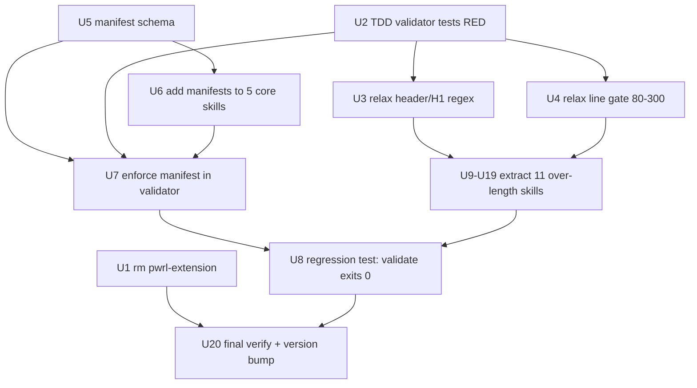

# Plan: PWRL Skills Standards Remediation & Phase-Step Enforcement

**Plan ID:** 2026-06-21-001-skills-standards-remediation
**Tier:** DEEP
**Complexity:** HIGH
**Effort estimate:** ~28 hours (multi-session)
**Created:** 2026-06-21
**Status:** ready-for-execution

---

## Problem & Scope

**Problem frame:** 24/31 PWRL skills fail `npm run validate:skills` (the repo's own skill-standard gate). Failures span 5 gates: line count (20 skills over 170), H1 exact match (20), missing `## Usage`/`## Input` (10), missing `## Workflow` (3), missing completion section (18), plus 1 orphaned empty `pwrl-extension/` directory. Separately, the `pwrl-phase-checkpoint` skill introduced 2026-06-21 validates artifacts *structurally* but core workflow skills are not *mechanically enforced* to follow their declared phase steps at runtime — gates are descriptive, not checked. Any agent or model can skip phase steps silently.

**Intended behavior:** After execution: (1) `npm run validate:skills` exits 0 across all 30 skills (`pwrl-extension` removed); (2) the validator enforces machine-checkable phase-step presence in the 5 core workflow skills (review, work, plan, tasks, learnings) via a deterministic, model-agnostic check; (3) a regression test fails when any core skill drops a required phase step, preventing future drift.

**Scope decisions (confirmed by user):**
- Line-count gate: **relax 80–170 → 80–300**; extract only the 11 skills still over 300 (hybrid: get green fast, defer further tightening to a future plan)
- Validator strictness: **relax header/H1 regexes** to accept common variants (`## Output: <Name>`, `# pwrl-<slug> — <Desc>`, etc.) — zero skill-file edits for these gates
- `pwrl-extension/`: **remove** the orphaned empty directory (skill count 31 → 30)
- Interaction mode: **detailed**

---

## Success Criteria

1. `npm run validate:skills` exits 0 with all 30 skills passing.
2. Validator enforces machine-checkable phase-step markers in the 5 core workflow skills (review, work, plan, tasks, learnings) — model-agnostic (checks the skill file, not agent runtime).
3. Regression test `tests/pwrl-standards/validate-skills.test.js` fails when any core skill drops a required phase step, included in `npm test`.

---

## Implementation Units

### U1 — Remove orphaned `pwrl-extension/` directory

**Files:** `pwrl-extension/` (rmdir)
**Approach:** `rmdir pwrl-extension` (empty dir, no content loss). Validator auto-discovers `pwrl-*` dirs, so removing it clears the "Missing file" failure automatically.
**Acceptance criteria:**
- `pwrl-extension/` no longer exists
- `npm run validate:skills` no longer reports `pwrl-extension` missing
**Dependencies:** none
**Effort:** 5 min

### U2 — TDD test suite for `validate-skills.js` (RED)

**Files:** `tests/pwrl-standards/validate-skills.test.js` (new)
**Approach:** Write failing tests describing the *intended relaxed* behavior: H1 accepted when starting with skill name (case-insensitive); `## Output: Foo`, `## Input: Foo`, `## Core Workflow: ...` accepted; line-count gate 80–300 (250 passes, 301 fails); phase-manifest enforcement (declared phase heading + step keywords must be present in core skills). Tests run under `npm test` glob `tests/**/*.test.js`. Run → RED (assertions fail against current strict validator).
**Acceptance criteria:**
- Suite exists and runs under `npm test`
- Tests assert all relaxed behaviors + manifest enforcement + regression (validate exits 0)
- Tests fail (Red) against current validator
**Test scenarios:** Red run confirms tests describe new behavior
**Dependencies:** none
**Effort:** 1.5 h

### U3 — Relax validator header/H1 regexes (GREEN for U2 header tests)

**Files:** `pwrl-standards/scripts/validate-skills.js`
**Approach:** In `hasSection()`, accept headers with colon/space suffixes: `^## (Output|Input|Usage|Workflow)[:\s].*` (and exact matches still pass). In H1 check, accept `^#\s+(pwrl-<slug>|PWRL <TitleCase>)\b` case-insensitive. No skill files edited.
**Acceptance criteria:**
- `hasSection()` accepts colon-suffixed variants
- H1 check accepts both `# pwrl-<slug> …` and `# PWRL <Title> …` (case-insensitive)
- U2 header/H1 tests: Green
**Test scenarios:** U2 suite Green; `validate:skills` header-only failures cleared
**Dependencies:** U2
**Effort:** 30 min

### U4 — Relax line-count gate 80–170 → 80–300 (+ update SCHEMA.md §3)

**Files:** `pwrl-standards/scripts/validate-skills.js`, `pwrl-standards/SCHEMA.md`
**Approach:** Change line-count bounds in validator to `80–300`. Update SCHEMA.md §3 Right-Sized: target 100–250, acceptable 80–300, note that a future plan will tighten incrementally. Add U2 test asserting 250-line passes, 301-line fails.
**Acceptance criteria:**
- Validator enforces `80 <= lineCount <= 300`
- SCHEMA.md §3 updated with new bounds + rationale
- U2 line-count tests: Green
**Test scenarios:** Only 11 over-300 skills still fail line gate
**Dependencies:** U2
**Effort:** 30 min

### U5 — Design phase-manifest schema for core skills

**Files:** `pwrl-standards/references/phase-manifest-schema.md` (new), `pwrl-standards/SCHEMA.md` (add section)
**Approach:** Define a YAML manifest format listing: `workflow` name, ordered `phases` (number, name), and per-phase `required_steps` (keyword strings that must appear in the corresponding `### Phase N:` section). Format must be parseable by the validator's existing simple key:value parser (no external yaml dep). Mark manifest REQUIRED for the 5 core orchestrators (review, work, plan, tasks, learnings), OPTIONAL elsewhere. Cross-reference `pwrl-phase-checkpoint/references/phase-schemas.md` as the source of phase definitions.
**Acceptance criteria:**
- Schema doc defines unambiguous, parseable format
- SCHEMA.md documents REQUIRED-vs-OPTIONAL rule
**Test scenarios:** Format review: parseable by simple regex/line parser
**Dependencies:** none
**Effort:** 1 h

### U6 — Add phase manifests to the 5 core skills

**Files:** `pwrl-review/references/phases.yaml`, `pwrl-work/references/phases.yaml`, `pwrl-plan/references/phases.yaml`, `pwrl-tasks/references/phases.yaml`, `pwrl-learnings/references/phases.yaml` (new)
**Approach:** For each core skill, enumerate its existing `### Phase N:` headings and the key step keywords per phase; write a `phases.yaml` manifest matching them. Verify manifest phase count == SKILL.md `### Phase` heading count.
**Acceptance criteria:**
- Each core skill has `references/phases.yaml`
- Manifest phases match existing `### Phase N:` headings
- Step keywords chosen appear in corresponding sections
**Test scenarios:** For each core skill: manifest phase count == heading count; keywords present
**Dependencies:** U5
**Effort:** 2 h

### U7 — Extend validator with phase-manifest enforcement (GREEN for U2 manifest tests)

**Files:** `pwrl-standards/scripts/validate-skills.js`, `tests/pwrl-standards/validate-skills.test.js`
**Approach:** When a skill has `references/phases.yaml`, validator loads it and verifies: (a) each declared phase has a corresponding `### Phase N:` heading in SKILL.md, (b) each declared step keyword appears within that phase's section (between this heading and the next `### ` or `## `). Enforcement is file-content-only → model-agnostic. Add Red-then-Green tests in U2 suite: remove a heading → fail; remove a keyword → fail; restore → pass. Non-core skills without manifest are not flagged.
**Acceptance criteria:**
- Manifest-driven phase + step-keyword checks implemented
- U2 manifest tests: Green
- Model-agnostic (no runtime/agent assumptions)
**Test scenarios:** Remove a `### Phase` heading from a core skill → validator fails; restore → passes; non-core skill unaffected
**Dependencies:** U2, U5, U6
**Effort:** 2 h

### U8 — Regression test: `npm run validate:skills` exits 0

**Files:** `tests/pwrl-standards/validate-skills.test.js` (extend U2)
**Approach:** Add a test that spawns `node pwrl-standards/scripts/validate-skills.js` and asserts exit code 0. This is success criterion #3 — any future regression (dropped phase, removed section, over-300 lines) fails CI.
**Acceptance criteria:**
- Test runs validator as child process, asserts exit 0
- Included in `npm test`
**Test scenarios:** Temporarily break a skill → test fails; restore → passes
**Dependencies:** U1, U3, U4, U7, U9–U19 (all skills must be green first)
**Effort:** 30 min

### U9 — Extract `pwrl-learnings-structure` (553 → ≤300)

**Files:** `pwrl-learnings-structure/SKILL.md`, `pwrl-learnings-structure/references/*.md`
**Approach:** Move detailed schema/format guidance, examples, and verbose step explanations into `references/*.md`. Keep SKILL.md as the imperative workflow with required sections (`## Usage`, `## Workflow`, `## Output`). Link extracted content from SKILL.md. Move, don't delete.
**Acceptance criteria:** SKILL.md ≤300 lines; extracted content in `references/` and linked; `validate:skills` passes
**Test scenarios:** Line count ≤300; diff review confirms content moved not lost
**Dependencies:** U3, U4
**Effort:** 1.5 h

### U10 — Extract `pwrl-work-execute` (516 → ≤300)

**Files:** `pwrl-work-execute/SKILL.md`, `pwrl-work-execute/references/*.md`
**Approach:** Same as U9 — extract detailed execution/gate content to `references/`, keep imperative workflow.
**Acceptance criteria:** SKILL.md ≤300 lines; extracted content linked; `validate:skills` passes
**Test scenarios:** Line count ≤300; diff review confirms moves
**Dependencies:** U3, U4
**Effort:** 1.5 h

### U11 — Extract `pwrl-work-prepare` (462 → ≤300)

**Files:** `pwrl-work-prepare/SKILL.md`, `pwrl-work-prepare/references/*.md`
**Approach:** Same as U9.
**Acceptance criteria:** SKILL.md ≤300 lines; extracted content linked; `validate:skills` passes
**Test scenarios:** Line count ≤300; diff review confirms moves
**Dependencies:** U3, U4
**Effort:** 1.5 h

### U12 — Extract `pwrl-work-sync-status` (425 → ≤300)

**Files:** `pwrl-work-sync-status/SKILL.md`, `pwrl-work-sync-status/references/*.md`
**Approach:** Same as U9.
**Acceptance criteria:** SKILL.md ≤300 lines; extracted content linked; `validate:skills` passes
**Test scenarios:** Line count ≤300; diff review confirms moves
**Dependencies:** U3, U4
**Effort:** 1.5 h

### U13 — Extract `pwrl-learnings` (411 → ≤300)

**Files:** `pwrl-learnings/SKILL.md`, `pwrl-learnings/references/*.md`
**Approach:** Same as U9. Note: this is an orchestrator; preserve the phase pipeline diagram and phase summaries, extract per-phase detail.
**Acceptance criteria:** SKILL.md ≤300 lines; extracted content linked; `validate:skills` passes
**Test scenarios:** Line count ≤300; diff review confirms moves
**Dependencies:** U3, U4
**Effort:** 1.5 h

### U14 — Extract `pwrl-review-report` (384 → ≤300)

**Files:** `pwrl-review-report/SKILL.md`, `pwrl-review-report/references/*.md`
**Approach:** Same as U9.
**Acceptance criteria:** SKILL.md ≤300 lines; extracted content linked; `validate:skills` passes
**Test scenarios:** Line count ≤300; diff review confirms moves
**Dependencies:** U3, U4
**Effort:** 1.5 h

### U15 — Extract `pwrl-learnings-extract` (352 → ≤300)

**Files:** `pwrl-learnings-extract/SKILL.md`, `pwrl-learnings-extract/references/*.md`
**Approach:** Same as U9.
**Acceptance criteria:** SKILL.md ≤300 lines; extracted content linked; `validate:skills` passes
**Test scenarios:** Line count ≤300; diff review confirms moves
**Dependencies:** U3, U4
**Effort:** 1.5 h

### U16 — Extract `pwrl-learnings-classify` (342 → ≤300)

**Files:** `pwrl-learnings-classify/SKILL.md`, `pwrl-learnings-classify/references/*.md`
**Approach:** Same as U9.
**Acceptance criteria:** SKILL.md ≤300 lines; extracted content linked; `validate:skills` passes
**Test scenarios:** Line count ≤300; diff review confirms moves
**Dependencies:** U3, U4
**Effort:** 1.5 h

### U17 — Extract `pwrl-plan` (327 → ≤300)

**Files:** `pwrl-plan/SKILL.md`, `pwrl-plan/references/*.md`
**Approach:** Same as U9. Preserve the four-phase pipeline diagram and phase summaries in SKILL.md; extract error handling, FAQs, architecture notes to `references/`.
**Acceptance criteria:** SKILL.md ≤300 lines; extracted content linked; `validate:skills` passes
**Test scenarios:** Line count ≤300; diff review confirms moves
**Dependencies:** U3, U4
**Effort:** 1.5 h

### U18 — Extract `pwrl-review` (326 → ≤300)

**Files:** `pwrl-review/SKILL.md`, `pwrl-review/references/*.md`
**Approach:** Same as U9.
**Acceptance criteria:** SKILL.md ≤300 lines; extracted content linked; `validate:skills` passes
**Test scenarios:** Line count ≤300; diff review confirms moves
**Dependencies:** U3, U4
**Effort:** 1.5 h

### U19 — Extract `pwrl-review-analyze` (324 → ≤300)

**Files:** `pwrl-review-analyze/SKILL.md`, `pwrl-review-analyze/references/*.md`
**Approach:** Same as U9.
**Acceptance criteria:** SKILL.md ≤300 lines; extracted content linked; `validate:skills` passes
**Test scenarios:** Line count ≤300; diff review confirms moves
**Dependencies:** U3, U4
**Effort:** 1.5 h

### U20 — Final verification + version bump

**Files:** `package.json`, `CHANGELOG.md`
**Approach:** Run `npm run validate:skills` (expect 0/30) and `npm test` (expect all green). Bump version 1.3.0 → 1.4.0 (minor: standards hardening + enforcement). Add `[1.4.0]` CHANGELOG entry summarizing: validator relaxations, line-gate 80–300, phase-manifest enforcement, 11 skill extractions, pwrl-extension removal, new test suite.
**Acceptance criteria:**
- `npm run validate:skills` exits 0, 0/30 failures
- `npm test` exits 0
- `CHANGELOG.md` updated; `package.json` bumped to 1.4.0
**Test scenarios:** Clean-clone verification: both commands green; all changes committed
**Dependencies:** U8, U9–U19
**Effort:** 30 min

---

## Risk Analysis

| Risk | Severity | Mitigation |
|------|----------|------------|
| Validator regex relax (U3/U4) masks real issues | low | U7 adds stronger mechanical enforcement; U8 regression test prevents drift |
| Content extraction (U9–U19) loses information | medium | Move not delete; diff-review each; keep `references/` linked from SKILL.md |
| Phase-manifest over-constrains skills | medium | REQUIRED only for 5 core skills; OPTIONAL elsewhere; step keywords chosen from existing content |
| 20-unit DEEP plan spans multiple sessions | medium | Natural session boundaries at extraction waves (U9–U19 independent); each wave committable |
| Relaxing line gate to 300 abandons right-sizing discipline | medium | Explicit deferral: a follow-up plan will tighten incrementally; documented in SCHEMA.md §3 |
| No external YAML parser in validator | low | Manifest format constrained to simple key:value parseable by existing frontmatter parser |

---

## Dependency Graph

**Critical path:** `U2 → U3 → U9..U19 → U8 → U20`
**Parallelizable:** U1, U2, U5 (Wave 1); U9–U19 (Wave 3, all independent)

---

## Execution Waves (suggested session boundaries)

- **Wave 1:** U1, U2, U5 — unblock all downstream work
- **Wave 2:** U3, U4, U6 — validator relax + manifests
- **Wave 3:** U7 ∥ U9, U10, U11, U12, U13, U14, U15, U16, U17, U18, U19 — enforcement + all extractions (independent; split across sessions)
- **Wave 4:** U8 — regression test (requires all skills green)
- **Wave 5:** U20 — final verify + version bump + commit

---

## Related Learnings (embedded)

- `workflow/sample-verification-quality-gate-2026-06-13.md` — after bulk extraction, verify 3 sample skills in detail to catch formatting issues (apply during U9–U19 review)
- `workflow/bulk-metadata-sync-2026-06-13.md` — parallel multi-replacement pattern applicable to validator regex changes across one file
- `pattern/skill-integration-testing-micro-skills-2026-06-10.md` — per-skill + cross-skill contract validation; U8 regression test instantiates this pattern for the validator
- `decision/coordinated-versioning-ecosystem-2026-06-13.md` — shared package.json version bump on completion (U20)
- `decision/interaction-modes-for-user-engagement.md` — detailed mode chosen for this plan

---

## Learning Gaps (to document post-implementation)

- **New learning candidate:** "Mechanical phase-step enforcement in skill files via phase manifest + validator" — the pattern of making advisory gates deterministic by adding a machine-readable manifest that a validator parses. Capture after U7.
- **New learning candidate:** "Validator regex relaxation as root-cause fix vs. bulk file rewrites" — the decision to relax `hasSection()` to accept colon-suffixed headers cleared 18 failures with zero skill edits. Capture after U3.

---

## Rollout Notes

- **TDD discipline:** U2 (RED) before U3/U4/U7 (GREEN). U8 is the acceptance regression test.
- **Commit cadence:** One commit per unit (or per extraction wave). Use `/pwrl-end-session` at session boundaries.
- **Future plan (deferred):** Tighten line-count gate from 300 toward 170 incrementally (e.g., 300 → 250 → 200 → 170 across future plans), extracting skills in batches. Track in `docs/learnings/` after this plan completes.
- **Backward compatibility:** Validator relaxations are backward-compatible (strict-form headers still pass). Line-gate change is permissive. Manifest enforcement applies only to skills that have a manifest.
- **No breaking changes to skill consumers** — SKILL.md content is reorganized, not removed; all extracted content remains accessible via `references/` links.

---

## Verification (final)

| Check | Command | Expected |
|-------|---------|----------|
| All skills pass standards | `npm run validate:skills` | exit 0, 0/30 failures |
| All tests pass | `npm test` | exit 0, all suites green |
| Regression test present | `node --test tests/pwrl-standards/validate-skills.test.js` | green |
| Version bumped | `grep version package.json` | 1.4.0 |
| Changelog updated | `grep "\[1.4.0\]" CHANGELOG.md` | match found |

---

**Plan generated by:** pwrl-plan pipeline (scope → research → design → generate)
**User-confirmed scope:** 2026-06-21 (detailed mode)
**User-confirmed design:** 2026-06-21 (20 units, DEEP tier, hybrid line-gate strategy)
