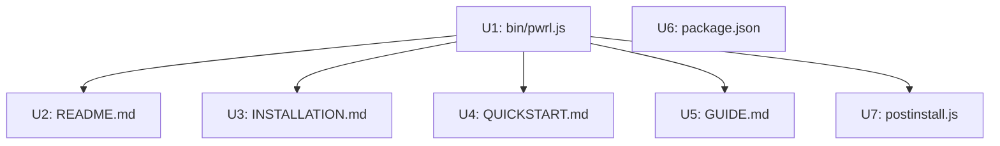

# Plan: Update Documentation and Installation Process

**Tier:** FAST
**Created:** 2026-06-24
**Complexity:** LOW
**Estimated effort:** ~2 hours
**Status:** Ready

---

## Problem & Scope

After the Wave 2 refactoring (pwrl-review orchestrator consolidation, pure orchestrator pattern, artifact chain implementation), the project's user-facing documentation and installation script are outdated. They still describe:

- **Per-project skills** installed in `.agents/skills/` (should be `~/.agents/skills/` global)
- **Interactive folder-location prompts** during `pwrl init` (should be removed)
- **Incremental version-check updates** for skills (should be clean replacement)
- **Custom skills path configuration** (should be fixed to `~/.agents/skills/`)

### Intended Behavior

1. `pwrl init` installs all skills **globally** into `~/.agents/skills/` — no questions asked about location
2. `pwrl init` **removes all existing** `pwrl-*` directories before copying fresh, ensuring clean state
3. All documentation consistently references `~/.agents/skills/` as the one and only skills location
4. Quick start guides, project structure diagrams, and code examples are self-consistent

---

## Success Criteria

1. **SC1:** Running `pwrl init` twice produces identical results — no stale skills, no version-check artifacts
2. **SC2:** All 4 documentation files (README, INSTALLATION, QUICKSTART, GUIDE) contain zero references to `.agents/skills/` or "custom location"
3. **SC3:** New user following the quick start in README.md end-to-end succeeds without confusion

---

## Related Learnings

| Learning | File | Applicability |
|----------|------|---------------|
| **Consolidation Strategy** | `2026-06-24-wave-2-refactoring-learnings.md` §2 | Single source of truth for skills path across all docs — update once in CLI, cascade to docs |
| **Blank Line Before Nested Lists** | `pattern/markdown-blank-line-before-nested-list-2026-06-24.md` | Ensure Markdown rendering is correct after edits |

---

## Implementation Units

### U1: Update `bin/pwrl.js` — Simplify init command

**Files:** `bin/pwrl.js` (lines 107-304), `bin/postinstall.js`
**Depends on:** None
**Effort:** 45 min

**Changes:**

1. **Remove skills folder location prompt** (currently lines 121-127)
2. **Add `os` module import** at top: `const os = require('os');`
3. **Hardcode destination** to `path.join(os.homedir(), '.agents', 'skills')`
4. **Remove all existing `pwrl-*` dirs first** — call `removeRecursiveSync` for each matching directory in the destination before copying
5. **Remove `compareVersions` function** (lines 192-214) — no longer needed with clean-replace strategy
6. **Remove version-check logic** (lines 216-247) — simplify to just: delete all existing, copy all bundled
7. **Keep GitHub Issues prompt** — still useful for task tracking
8. **Update `.pwrlrc.json` writing** — `skillsPath` should now be `~/.agents/skills` (or the absolute path resolved)
9. **Update success messages** — remove references to "Skills location" config line
10. **Update `bin/postinstall.js`** — adjust postinstall message references

**Acceptance criteria:**
- `pwrl init` with no existing skills → copies all `pwrl-*` dirs to `~/.agents/skills/`
- `pwrl init` with existing skills → deletes all existing `pwrl-*` dirs, then copies fresh
- No interactive prompt for skills location
- `.pwrlrc.json` correctly records the path

### U2: Update README.md

**Files:** `README.md`
**Depends on:** U1 (for consistency)
**Effort:** 20 min

**Changes:**

- **Quick Start section (lines 11-28):**
  - Remove "interactive setup" language (line 16)
  - Change "Skills will be copied to .agents/skills/ (or your custom location)" → "Skills are installed globally to ~/.agents/skills/"
  - Update line 18 to reflect no location choice
- **Configuration section (lines 166-173):**
  - Remove "Skills location" and "or your custom location" language
  - Update to: "Skills are always installed in ~/.agents/skills/"
- **Installation section (lines 269-282):**
  - Remove per-project install instructions
  - Simplify to global-only
- **Project Structure section (lines 315-346):**
  - Remove `.agents/skills/` from project tree (skills live globally now)
  - Add note: "PWRL skills are installed globally at ~/.agents/skills/"
- **Search/replace:** All `.agents/skills/` → `~/.agents/skills/`

**Acceptance criteria:**
- No reference to `.agents/skills/`, "custom location", or interactive folder selection
- Quick Start section is copy-paste runnable

### U3: Update INSTALLATION.md

**Files:** `INSTALLATION.md`
**Depends on:** U1
**Effort:** 20 min

**Changes:**

- **Quick Start section (lines 7-21):**
  - Remove "During initialization, you'll be asked:" paragraphs (lines 16-21)
  - Replace with: "Skills are installed globally to ~/.agents/skills/. Run pwrl init in each project to configure."
- **Directory Structure section (lines 34-66):**
  - Remove `.agents/skills/` tree from project structure
  - Add note that skills live at `~/.agents/skills/`
- **Configuration section (lines 124-140):**
  - Update JSON example — remove or update `skillsPath`
- **Platform Setup sections:**
  - Update paths from `.agents/skills/` → `~/.agents/skills/`

**Acceptance criteria:**
- No reference to interactive folder selection
- Platform-specific instructions reference `~/.agents/skills/`

### U4: Update QUICKSTART.md

**Files:** `QUICKSTART.md`
**Depends on:** U1
**Effort:** 15 min

**Changes:**

- **Installation and Setup (lines 9-20):**
  - Remove "Follow prompts to configure" (lines 17-19)
  - Simplify to: "Skills are installed globally at ~/.agents/skills/"
- **Search/replace:** All `.agents/skills/` → `~/.agents/skills/`

**Acceptance criteria:**
- No interactive-setup language
- Workflow examples reference correct paths

### U5: Update GUIDE.md

**Files:** `GUIDE.md`
**Depends on:** U1
**Effort:** 15 min

**Changes:**

- **Search/replace:** All `.agents/skills/` → `~/.agents/skills/`
- Review relevant sections discussing skills location for contextual updates

**Acceptance criteria:**
- No stale `.agents/skills/` references remain
- Philosophy/best-practices sections are path-consistent

### U6: Update package.json files array

**Files:** `package.json`
**Depends on:** None (independent)
**Effort:** 5 min

**Changes:**

- Review `"files"` array — `"agents/**/*"` entry may be stale if that directory no longer exists
- Remove if not needed

**Acceptance criteria:**
- `npm pack --dry-run` shows expected files

### U7: Update postinstall.js

**Files:** `bin/postinstall.js`
**Depends on:** U1
**Effort:** 10 min

**Changes:**

- Update message to reflect global-only installation
- Update path references in the message

**Acceptance criteria:**
- Post-install message accurately describes the new init behavior

---

## Dependency Graph

- **U1** is the foundational change — docs must align with the new CLI behavior
- **U2-U5** can be executed in parallel after U1
- **U6** is independent and can run at any time
- **U7** is a small follow-up to U1

---

## Execution Order

1. **U1** — Update `bin/pwrl.js` init command
2. **U2-U5, U7** (parallel) — Update all documentation files
3. **U6** — Validate package.json

---

## Rollout Notes

- **No breaking changes** for existing users who have already run `pwrl init` — their project's `.pwrlrc.json` will be updated on next `pwrl init`
- Users who previously installed skills in a custom location should re-run `pwrl init` to migrate to `~/.agents/skills/`
- The `~/.agents/skills/` directory is the standard location for Zed/Copilot agent skills — this aligns PWRL with platform conventions
- GitHub Issues integration prompt is preserved (unchanged behavior)

---

## Risk Analysis

| Risk | Likelihood | Impact | Mitigation |
|------|-----------|--------|------------|
| Users with custom skills locations lose references | LOW | MEDIUM | Document migration path in INSTALLATION.md |
| `os.homedir()` resolves differently on some platforms | LOW | LOW | Node.js `os.homedir()` is cross-platform stable |
| Existing skills in `~/.agents/skills/` from other tools get deleted | LOW | HIGH | Only delete `pwrl-*` prefixed directories, not all skills |

---

## Files Affected

| File | Unit | Type of Change |
|------|------|---------------|
| `bin/pwrl.js` | U1 | Major rewrite of `initProject()` |
| `bin/postinstall.js` | U7 | Minor message update |
| `README.md` | U2 | Path references, quick start, project structure |
| `INSTALLATION.md` | U3 | Path references, interactive setup removal |
| `QUICKSTART.md` | U4 | Path references, interactive setup removal |
| `GUIDE.md` | U5 | Search/replace path references |
| `package.json` | U6 | Review `files` array |

---

*Plan generated by pwrl-plan (FAST tier) on 2026-06-24.*
