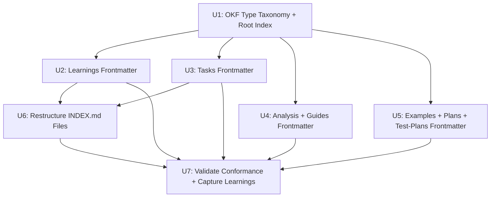

# Task Index

**Generated:** 2026-06-28
**Source Plan:** [OKF Compliance Migration for PWRL Documents](../plans/2026-06-28-001-okf-compliance-migration.md)
**Total Tasks:** 7

## Quick Stats

- **To Do:** 7 tasks
- **In Progress:** 0 tasks
- **Done:** 0 tasks
- **Blocked:** 0 tasks

## Execution Roadmap

### Critical Path

The longest dependency chain (determines minimum project duration):

```
U1 → U2 → U6 → U7 (4 tasks)
```

Also: U1 → U3 → U6 → U7 (same length, 4 tasks)

### Recommended Starting Tasks

These tasks have no dependencies and can start immediately:

* [U1: Define OKF Type Taxonomy & Create Root Index](to-do/2026-06-28-u1-okf-type-taxonomy-and-root-index.md) — Establish standard type values for all PWRL document categories.

### Parallel Execution Groups

Tasks organized by when they can start:

**Group 1** (Start immediately):
* [U1: Define OKF Type Taxonomy & Create Root Index](to-do/2026-06-28-u1-okf-type-taxonomy-and-root-index.md)

**Group 2** (After U1 — all can run in parallel):
* [U2: Update Learnings Frontmatter](to-do/2026-06-28-u2-update-learnings-frontmatter.md) — 36 learning docs
* [U3: Update Tasks Frontmatter](to-do/2026-06-28-u3-update-tasks-frontmatter.md) — 31 task docs
* [U4: Update Analysis & Guides Frontmatter](to-do/2026-06-28-u4-update-analysis-guides-frontmatter.md) — 10 analysis + guide docs
* [U5: Update Examples, Plans & Test-Plans Frontmatter](to-do/2026-06-28-u5-update-examples-plans-testplans-frontmatter.md) — 7 docs

**Group 3** (After U2 and U3):
* [U6: Restructure INDEX.md Files](to-do/2026-06-28-u6-restructure-index-files.md) — depends on U2, U3

**Group 4** (After U2, U3, U4, U5, U6):
* [U7: Validate OKF Conformance & Capture Learnings](to-do/2026-06-28-u7-validate-conformance-and-capture-learnings.md) — depends on all prior tasks

## All Tasks

### To Do

| Unit ID | Task | Dependencies | Files |
|---------|------|--------------|-------|
| U1 | [Define OKF Type Taxonomy & Create Root Index](to-do/2026-06-28-u1-okf-type-taxonomy-and-root-index.md) | None | `docs/OKF-TYPES.md`, `docs/index.md` |
| U2 | [Update Learnings Frontmatter](to-do/2026-06-28-u2-update-learnings-frontmatter.md) | U1 | 36 files in `docs/learnings/` |
| U3 | [Update Tasks Frontmatter](to-do/2026-06-28-u3-update-tasks-frontmatter.md) | U1 | 31 files in `docs/tasks/` |
| U4 | [Update Analysis & Guides Frontmatter](to-do/2026-06-28-u4-update-analysis-guides-frontmatter.md) | U1 | 10 files in `docs/analysis/`, `docs/guides/` |
| U5 | [Update Examples, Plans & Test-Plans Frontmatter](to-do/2026-06-28-u5-update-examples-plans-testplans-frontmatter.md) | U1 | 7 files in `docs/examples/`, `docs/plans/`, `docs/test-plans/` |
| U6 | [Restructure INDEX.md Files](to-do/2026-06-28-u6-restructure-index-files.md) | U2, U3 | `docs/learnings/INDEX.md`, `docs/tasks/INDEX.md` |
| U7 | [Validate Conformance & Capture Learnings](to-do/2026-06-28-u7-validate-conformance-and-capture-learnings.md) | U2, U3, U4, U5, U6 | ~85 files (validate), 1 new learning |

### In Progress

| Unit ID | Task | Dependencies | Files |
|---------|------|--------------|-------|
| — | — | — | — |

### Done

| Unit ID | Task | Dependencies | Files |
|---------|------|--------------|-------|
| — | — | — | — |

### Blocked

| Unit ID | Task | Dependencies | Files |
|---------|------|--------------|-------|
| — | — | — | — |

## Dependency Graph



## Task Status

### Status Tracking

Tasks are tracked by:
1. **File Location:** All tasks start in `docs/tasks/to-do/`
2. **Frontmatter:** Update `status` field to `in-progress`, `for-review`, or `done`

**To mark a task in-progress:**
```yaml
status: in-progress
```

**To mark a task complete:**
```yaml
status: done
```

### Updating This Index

Regenerate when tasks change status or dependencies shift. New tasks follow the naming convention `YYYY-MM-DD-uX-<slug>.md`.

## Notes

- U2, U3, U4, U5 all depend only on U1 and can execute in parallel — this is where the most time savings come from
- U6 and U7 are sequential gates; U7 validates everything
- Total files touched: ~85 concept docs + 3 index files + 2 new files = ~90 files
- The migration is docs-only with zero code changes; git history provides full rollback
- All tasks are self-contained; each task file contains complete implementation steps and verification commands

---

**Last Updated:** 2026-06-28
