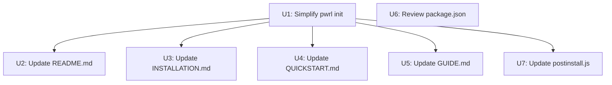

# Task Index

**Generated:** 2026-06-24
**Source Plan:** [Update Documentation and Installation Process](../plans/2026-06-24-001-update-docs-and-installation.md)
**Total Tasks:** 7

## Quick Stats

- **To Do:** 0 tasks
- **In Progress:** 0 tasks
- **For Review:** 0 tasks
- **Done:** 7 tasks
- **Blocked:** 0 tasks

## Execution Roadmap

### Critical Path

The longest dependency chain:

```
U1 → U2 → (end)
U1 → U3 → (end)
U1 → U4 → (end)
U1 → U5 → (end)
U1 → U7 → (end)
U6 → (end)
```

**Effective depth:** 2 levels. U1 is the only gateway task; after it completes, U2-U5+U7 can all run in parallel.

### Recommended Starting Tasks

These tasks have no dependencies and can start immediately:

- ~~[U1 - Simplify pwrl init command](done/2026-06-24-u1-simplify-init-command.md)~~ ✅
- ~~[U6 - Review package.json files array](done/2026-06-24-u6-review-package-json.md)~~ ✅
- ~~[U2 - Update README.md](done/2026-06-24-u2-update-readme.md)~~ ✅
- ~~[U3 - Update INSTALLATION.md](done/2026-06-24-u3-update-installation.md)~~ ✅
- ~~[U4 - Update QUICKSTART.md](done/2026-06-24-u4-update-quickstart.md)~~ ✅
- ~~[U5 - Update GUIDE.md](done/2026-06-24-u5-update-guide.md)~~ ✅
- ~~[U7 - Update postinstall.js](done/2026-06-24-u7-update-postinstall.md)~~ ✅

### Parallel Execution Groups

**Group 1** (Start immediately — no dependencies):
- U1: Simplify pwrl init command
- U6: Review package.json files array

**Group 2** (After U1 completes):
- U2: Update README.md
- U3: Update INSTALLATION.md
- U4: Update QUICKSTART.md
- U5: Update GUIDE.md
- U7: Update postinstall.js

All Group 2 tasks can run in parallel — they touch different files with no cross-dependencies.

## All Tasks

### To Do

*(Empty — all tasks completed)*

### In Progress

*(Empty — no tasks in progress)*

### For Review

*(Empty — all tasks moved to done/)*

### Done

| Unit ID | Task | Dependencies | Files |
|---------|------|--------------|-------|
| U1 | [Simplify pwrl init command](done/2026-06-24-u1-simplify-init-command.md) | None | `bin/pwrl.js`, `bin/postinstall.js`, `lib/config.js` |
| U2 | [Update README.md](done/2026-06-24-u2-update-readme.md) | U1 | `README.md` |
| U3 | [Update INSTALLATION.md](done/2026-06-24-u3-update-installation.md) | U1 | `INSTALLATION.md` |
| U4 | [Update QUICKSTART.md](done/2026-06-24-u4-update-quickstart.md) | U1 | `QUICKSTART.md` |
| U5 | [Update GUIDE.md](done/2026-06-24-u5-update-guide.md) | U1 | `GUIDE.md` |
| U6 | [Review package.json files array](done/2026-06-24-u6-review-package-json.md) | None | `package.json` |
| U7 | [Update postinstall.js](done/2026-06-24-u7-update-postinstall.md) | U1 | `bin/postinstall.js` |

## Dependency Graph



**Note:** U6 is intentionally disconnected — it has no dependencies and can run at any time.

## Task Status

### Status Tracking

Tasks move through folders as they progress:
- `to-do/` → `in-progress/` → `for-review/` → `done/`

To start a task, use `/pwrl-work docs/tasks/to-do/YYYY-MM-DD-uX-name.md`.

### Updating This Index

Re-run `/pwrl-tasks` or manually update when:
- Tasks change status folders
- Dependencies are modified
- New tasks are added

## Notes

- **U1 is the critical gateway task** — all documentation tasks (U2-U5, U7) depend on its completion to ensure consistency with the actual CLI behavior
- **U6 is a quick-win** — can be done at any time, even before U1
- **U2-U5 + U7 are documentation-only** — no code changes, just search/replace and section rewrites in Markdown files
- **Learnings:** U1 references the Consolidation Strategy learning for single-source-of-truth principle applied to the skills path

---

**Last Updated:** 2026-06-24
