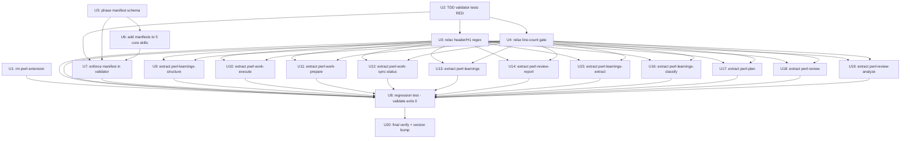

# Task Index

**Generated:** 2026-06-21
**Source Plan:** [PWRL Skills Standards Remediation & Phase-Step Enforcement](../plans/2026-06-21-001-skills-standards-remediation.md)
**Total Tasks:** 20
**Tier:** DEEP

## Quick Stats

- **To Do:** 20 tasks
- **In Progress:** 0 tasks
- **Done:** 0 tasks
- **Blocked:** 0 tasks

## Execution Roadmap

### Critical Path

```
U2 → U3 → U9..U19 → U8 → U20
```

The extraction wave (U9–U19) is the long tail; U5/U6/U7 (manifest enforcement) can run in parallel with extractions.

### Recommended Starting Tasks

No dependencies — can start immediately:

- [U1 - Remove orphaned pwrl-extension/](to-do/2026-06-21-u1-rm-pwrl-extension.md)
- [U2 - TDD validator tests (RED)](to-do/2026-06-21-u2-tdd-validator-tests.md)
- [U5 - Phase manifest schema](to-do/2026-06-21-u5-phase-manifest-schema.md)

### Parallel Execution Groups

**Group 1** (Start immediately): U1, U2, U5
- [U1 - rm pwrl-extension](to-do/2026-06-21-u1-rm-pwrl-extension.md)
- [U2 - TDD validator tests RED](to-do/2026-06-21-u2-tdd-validator-tests.md)
- [U5 - phase manifest schema](to-do/2026-06-21-u5-phase-manifest-schema.md)

**Group 2** (After Group 1): U3, U4 (need U2); U6 (needs U5)
- [U3 - relax header/H1 regex](to-do/2026-06-21-u3-relax-header-h1-regex.md) — needs U2
- [U4 - relax line-count gate](to-do/2026-06-21-u4-relax-line-count-gate.md) — needs U2
- [U6 - add phase manifests to 5 core skills](to-do/2026-06-21-u6-add-phase-manifests-core-skills.md) — needs U5

**Group 3** (After Group 2): U7 (needs U2+U5+U6) ∥ U9–U19 (need U3+U4; all independent of each other)
- [U7 - enforce phase manifest in validator](to-do/2026-06-21-u7-enforce-phase-manifest-validator.md)
- [U9–U19 - extract 11 over-length skills](#all-tasks) (independent; split across sessions)

**Group 4** (After Group 3): U8 (needs U1+U3+U4+U7+U9–U19)
- [U8 - regression test: validate exits 0](to-do/2026-06-21-u8-regression-test-validate-exits-zero.md)

**Group 5** (After Group 4): U20
- [U20 - final verify + version bump](to-do/2026-06-21-u20-final-verify-version-bump.md)

## All Tasks

### To Do

| Unit ID | Task | Dependencies | Files |
|---------|------|--------------|-------|
| U1 | [Remove orphaned pwrl-extension/](to-do/2026-06-21-u1-rm-pwrl-extension.md) | None | `pwrl-extension/` |
| U2 | [TDD validator tests (RED)](to-do/2026-06-21-u2-tdd-validator-tests.md) | None | `tests/pwrl-standards/validate-skills.test.js` |
| U3 | [Relax header/H1 regex](to-do/2026-06-21-u3-relax-header-h1-regex.md) | U2 | `pwrl-standards/scripts/validate-skills.js` |
| U4 | [Relax line-count gate 80-300](to-do/2026-06-21-u4-relax-line-count-gate.md) | U2 | `pwrl-standards/scripts/validate-skills.js`, `pwrl-standards/SCHEMA.md` |
| U5 | [Phase manifest schema](to-do/2026-06-21-u5-phase-manifest-schema.md) | None | `pwrl-standards/references/phase-manifest-schema.md`, `pwrl-standards/SCHEMA.md` |
| U6 | [Add phase manifests to 5 core skills](to-do/2026-06-21-u6-add-phase-manifests-core-skills.md) | U5 | `pwrl-{review,work,plan,tasks,learnings}/references/phases.yaml` |
| U7 | [Enforce phase manifest in validator](to-do/2026-06-21-u7-enforce-phase-manifest-validator.md) | U2, U5, U6 | `pwrl-standards/scripts/validate-skills.js`, `tests/pwrl-standards/validate-skills.test.js` |
| U8 | [Regression test: validate exits 0](to-do/2026-06-21-u8-regression-test-validate-exits-zero.md) | U1, U3, U4, U7, U9–U19 | `tests/pwrl-standards/validate-skills.test.js` |
| U9 | [Extract pwrl-learnings-structure](to-do/2026-06-21-u9-extract-pwrl-learnings-structure.md) | U3, U4 | `pwrl-learnings-structure/SKILL.md`, `pwrl-learnings-structure/references/` |
| U10 | [Extract pwrl-work-execute](to-do/2026-06-21-u10-extract-pwrl-work-execute.md) | U3, U4 | `pwrl-work-execute/SKILL.md`, `pwrl-work-execute/references/` |
| U11 | [Extract pwrl-work-prepare](to-do/2026-06-21-u11-extract-pwrl-work-prepare.md) | U3, U4 | `pwrl-work-prepare/SKILL.md`, `pwrl-work-prepare/references/` |
| U12 | [Extract pwrl-work-sync-status](to-do/2026-06-21-u12-extract-pwrl-work-sync-status.md) | U3, U4 | `pwrl-work-sync-status/SKILL.md`, `pwrl-work-sync-status/references/` |
| U13 | [Extract pwrl-learnings](to-do/2026-06-21-u13-extract-pwrl-learnings.md) | U3, U4 | `pwrl-learnings/SKILL.md`, `pwrl-learnings/references/` |
| U14 | [Extract pwrl-review-report](to-do/2026-06-21-u14-extract-pwrl-review-report.md) | U3, U4 | `pwrl-review-report/SKILL.md`, `pwrl-review-report/references/` |
| U15 | [Extract pwrl-learnings-extract](to-do/2026-06-21-u15-extract-pwrl-learnings-extract.md) | U3, U4 | `pwrl-learnings-extract/SKILL.md`, `pwrl-learnings-extract/references/` |
| U16 | [Extract pwrl-learnings-classify](to-do/2026-06-21-u16-extract-pwrl-learnings-classify.md) | U3, U4 | `pwrl-learnings-classify/SKILL.md`, `pwrl-learnings-classify/references/` |
| U17 | [Extract pwrl-plan](to-do/2026-06-21-u17-extract-pwrl-plan.md) | U3, U4 | `pwrl-plan/SKILL.md`, `pwrl-plan/references/` |
| U18 | [Extract pwrl-review](to-do/2026-06-21-u18-extract-pwrl-review.md) | U3, U4 | `pwrl-review/SKILL.md`, `pwrl-review/references/` |
| U19 | [Extract pwrl-review-analyze](to-do/2026-06-21-u19-extract-pwrl-review-analyze.md) | U3, U4 | `pwrl-review-analyze/SKILL.md`, `pwrl-review-analyze/references/` |
| U20 | [Final verify + version bump](to-do/2026-06-21-u20-final-verify-version-bump.md) | U8, U9–U19 | `package.json`, `CHANGELOG.md` |

### In Progress

*(Empty on initial generation)*

### Done

*(Empty on initial generation)*

### Blocked

*(Empty on initial generation)*

## Dependency Graph



## Task Status

Tasks are tracked by file location (`to-do/` → `in-progress/` → `for-review/` → `done/`) and by the `status` frontmatter field. Update both when moving a task.

## Notes

- **Old index preserved:** the prior `INDEX.md` (for the 2026-06-05 plan-slice work) was backed up to `docs/tasks/INDEX-2026-06-05-plan-slice.md` before this index was written.
- **Stale tasks:** 8 tasks from `2026-06-10-u1..u8-*` remain in `to-do/` from a prior superseded effort (the 2026-06-16 agent-removal refactor obsoleted them). They are unrelated to this plan; left untouched per the "never delete without confirmation" rule. Consider archiving them in a separate cleanup.
- **Session boundaries:** the extraction wave (U9–U19) splits naturally across ~4 sessions (3 skills per session). U1–U8 form a single "validator + enforcement" session.
- **TDD discipline:** U2 (RED) must precede U3/U4/U7 (GREEN). U8 is the final acceptance gate.

---

**Last Updated:** 2026-06-21
