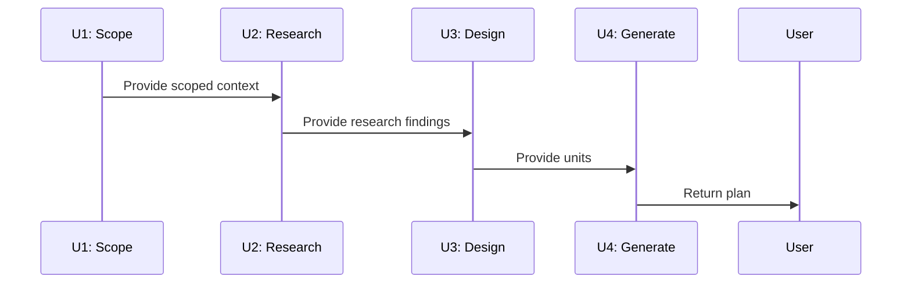

> ⚠️ **ARCHIVED & SUPERSEDED** — 2026-06-10
> 
> This task has been superseded by a comprehensive fix & verification plan:
> **[Fix and Verify PWRL Plan Micro-Skills for Production Readiness](docs/plans/2026-06-10-002-fix-and-verify-pwrl-plan.md)**
> 
> The implementation from this task (pwrl-plan-design/SKILL.md) is complete and in use.
> However, critical P0/P1 findings from code review require fixes to enable production deployment.
> 
> **Related work:** 
> - Code review: `.context/pwrl-review/pwrl-plan-comprehensive-review/review.md`
> - New plan: `docs/plans/2026-06-10-002-fix-and-verify-pwrl-plan.md`
> - New tasks: `docs/tasks/to-do/2026-06-10-u*.md`
> 
> ---

# S4: Create pwrl-plan-design Micro-Skill

## Goal

Extract Phase 3 (Implementation Units) logic from monolithic `pwrl-plan/SKILL.md` into a standalone `pwrl-plan-design` micro-skill. This skill breaks work into stable U-IDs (U1, U2, etc.), optionally generates Mermaid diagrams, and produces implementation units that the final plan generation step consumes.

## Context

Phase 3 handles:
- Breaking work into stable, numbered implementation units (U1, U2, … UX)
- Creating unit definitions: scope, affected files, approach, acceptance criteria
- Optionally generating Mermaid diagrams (sequence/state/flowchart) for complex logic
- Ensuring U-ID stability (IDs never renumber)

This task extracts that logic as an independent skill.

**Why this matters:** Implementation units are the backbone of the plan; they define what gets built and in what order.

**Dependency:** Depends on S1, S2, S3. Receives scoped context and research findings from S2 & S3.

## Related Learnings

- **Learning: Implementation Unit Design** (if exists at `docs/learnings/unit-design.md`)
  - *Applicability:* Guides unit decomposition strategy; defines stability rules.

**Learning Gap:** If no learning for "Mermaid Diagram Patterns in Plans" exists, create one via `/pwrl-learnings` after S4 completes.

## Implementation Steps

1. **Extract Phase 3 Logic from pwrl-plan/SKILL.md**
   - Read Phase 3: Implementation Units section
   - Identify all sub-steps:
     - U-ID generation and stability rules
     - Unit scope definition
     - Files affected identification
     - Approach documentation
     - Acceptance criteria definition
     - Optional Mermaid diagram generation

2. **Design Skill Interface**
   - **Input:** Scoped context from S2 + Research findings from S3
   - **Output:** Implementation units object:
     ```
     {
       "units": [
         {
           "id": "U1",
           "name": "...",
           "scope": "...",
           "files": ["...", "..."],
           "approach": "...",
           "acceptance_criteria": ["...", "..."]
         },
         ...
       ],
       "diagram": "mermaid code (optional)",
       "complexity_hints": "fast|standard|deep"
     }
     ```

3. **Create SKILL.md**
   - Path: `skills/pwrl-plan-design/SKILL.md`
   - Implement U-ID generator:
     - Start at U1, increment sequentially
     - Document stability rule: once assigned, U-ID never changes
     - Keep registry of used U-IDs
   - Implement unit breakdown algorithm:
     - Ask user: How many major phases? (or auto-detect from context)
     - For each phase: define scope, files, approach
     - Collect acceptance criteria per unit

4. **Implement Unit Definition Logic**
   - For each unit, capture:
     - **Name:** Short, descriptive title
     - **Scope:** What does this unit accomplish?
     - **Files:** Which files are affected (repository-relative paths)
     - **Approach:** How will this be implemented? (directional, not code)
     - **Acceptance:** Specific conditions for completion
   - Use ask_user tool for user guidance through each unit

5. **Implement Optional Mermaid Diagram Generation**
   - Detect: Is this a complex workflow (10+ units or high-risk)?
   - If yes: Ask user if they want diagram
   - Generate diagram:
     - Sequence diagrams: for workflow/interaction patterns
     - State diagrams: for state machine logic
     - Flowcharts: for decision trees
   - Include diagram in output (optional, can be skipped)

6. **Implement Complexity Hinting**
   - Based on unit count:
     - 1-3 units → Fast tier
     - 4-8 units → Standard tier
     - 9+ units → Deep tier
   - Use this hint for S5 (plan generation tier selection)

7. **Create references/unit-template.md (if needed)**
   - Document unit definition format
   - Provide examples: typical units for common scenarios (CRUD, API, UI feature, etc.)

## Code Patterns

**Example: U-ID Generation & Stability**

```javascript
// Pseudo-code for stable U-ID management
class UnitRegistry {
  constructor() {
    this.units = [];
    this.nextId = 1;
  }

  addUnit(name, scope, files, approach, criteria) {
    const id = `U${this.nextId++}`;
    return {
      id,
      name,
      scope,
      files,
      approach,
      acceptance_criteria: criteria
    };
  }

  // Critical: IDs never renumber, even if units are deleted
  deleteUnit(id) {
    this.units = this.units.filter(u => u.id !== id);
    // DO NOT decrement nextId or renumber
  }
}
```

**Example: Mermaid Diagram (Sequence)**



**Example: Unit Definition**

```markdown
### U1: Extract Templates Module
- **Scope:** Verify and expose plan templates for reuse
- **Files Affected:** `skills/pwrl-plan/references/plan-templates.md`
- **Approach:** Audit existing templates; ensure completeness; document in reusable format
- **Acceptance Criteria:**
  - All three tier templates (Fast/Standard/Deep) are documented
  - Templates are copy-paste ready
  - All required sections per tier are present
```

## Edge Cases

1. **User is unsure how many units are needed**
   - Solution: Start with rough estimate; ask_user provides guidance
   - Offer: "Typical medium-complexity task: 5-7 units. Does that sound right?"

2. **Units have complex interdependencies**
   - Solution: Document dependencies clearly in unit definition
   - Consider Mermaid diagram for clarity

3. **Complexity is on boundary (e.g., exactly 8 units)**
   - Solution: Err toward higher tier (Standard → Deep)
   - Document reason in complexity_hints

4. **User declines Mermaid diagram**
   - Solution: Proceed without diagram; S5 will handle gracefully

5. **Unit descriptions are too vague**
   - Solution: Ask clarifying follow-up questions
   - Example: "For U3, you said 'refactor'. More specifically: replace pattern X with pattern Y?"

## Testing

### Unit Test: U-ID Generation & Stability

- **Input:** 5 units created, then U2 deleted, then U3 modified
- **Verification:**
  - U1, U3, U4, U5 remain with original IDs (NOT U1, U2, U3, U4)
  - No renumbering occurs
  - Stability rule is maintained

### Unit Test: Unit Definition Completeness

- **Input:** Created unit (from user input via ask_user)
- **Verification:**
  - Unit has all required fields: id, name, scope, files, approach, acceptance_criteria
  - File paths are repository-relative
  - Acceptance criteria are specific and measurable

### Unit Test: Complexity Hinting

- **Input:** 3 units created; 7 units created; 12 units created
- **Verification:**
  - 3 units → hint: "fast"
  - 7 units → hint: "standard"
  - 12 units → hint: "deep"

### Unit Test: Mermaid Diagram Generation

- **Input:** 8 complex-interdependent units
- **Verification:**
  - Skill offers diagram generation
  - User can accept or decline
  - If accepted: valid Mermaid syntax is returned
  - If declined: process continues without diagram

### Integration Test: Units → Plan Generation State Passing

- **Input:** Scoped context + research findings + units designed
- **Verification:**
  - Units object is valid and complete
  - Can be parsed and passed to S5 (pwrl-plan-generate)
  - Complexity hint informs S5 tier selection
  - All information is preserved in state passing

## Acceptance Criteria

✅ `skills/pwrl-plan-design/SKILL.md` exists and is functional  
✅ U-ID generation works; IDs are stable and never renumber  
✅ Unit definitions include all required fields (scope, files, approach, acceptance)  
✅ File paths in units are repository-relative  
✅ Complexity hinting works: unit count → Fast/Standard/Deep  
✅ Mermaid diagram generation is optional and works correctly  
✅ ask_user tool is used for guiding unit creation  
✅ Units object schema is well-documented  
✅ State passing to S5 is clear and preserves all information  
✅ Skill works independently; tested without S5  
✅ Handles edge cases gracefully (vague descriptions, complex dependencies, etc.)  

## References

- Source: Phase 3 section in `skills/pwrl-plan/SKILL.md`
- Input state: From S2 (scoped context) + S3 (research findings)
- Used by: S5 (pwrl-plan-generate) — receives units
- Output state: Passed to S5 for plan generation

