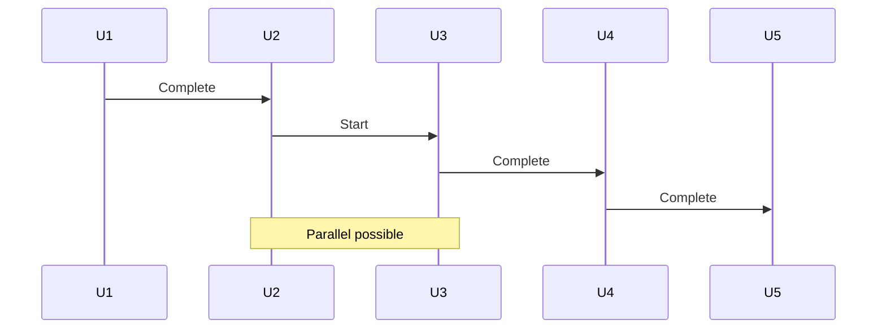
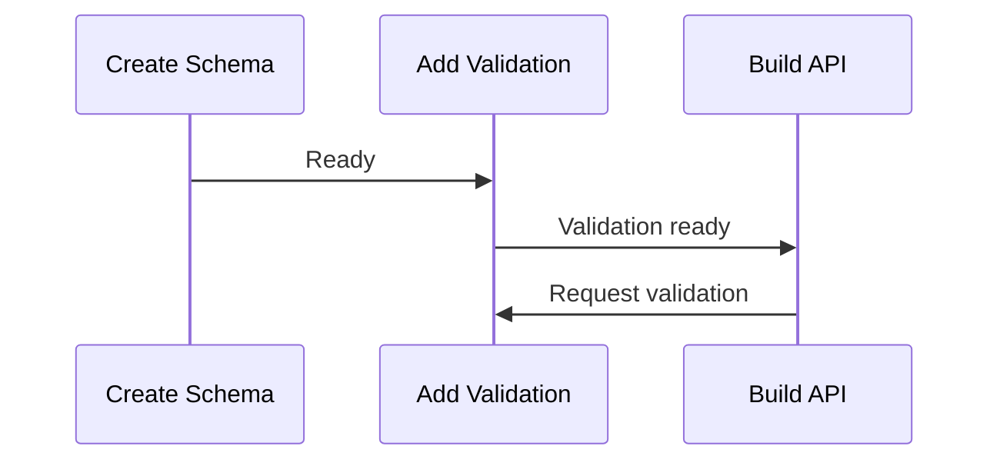
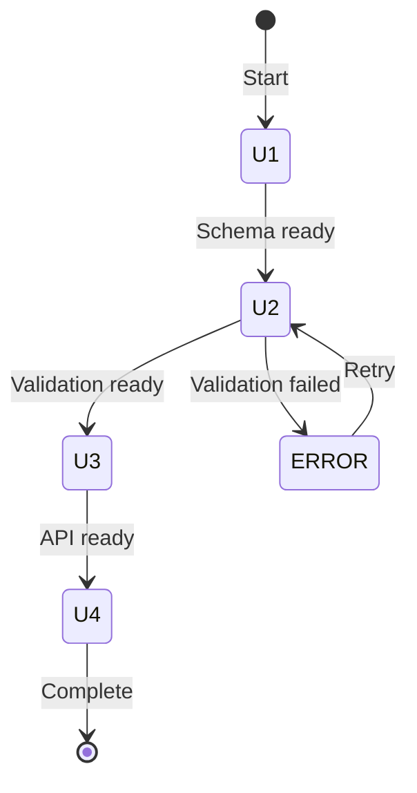
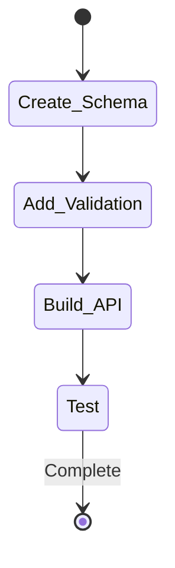
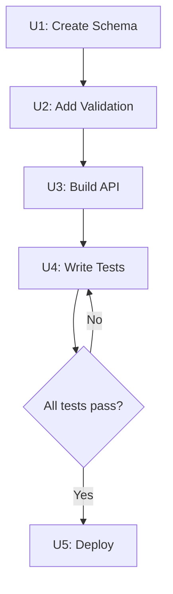
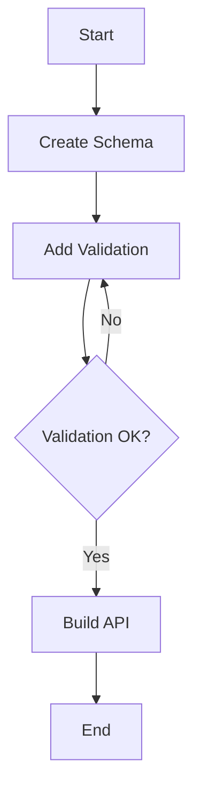
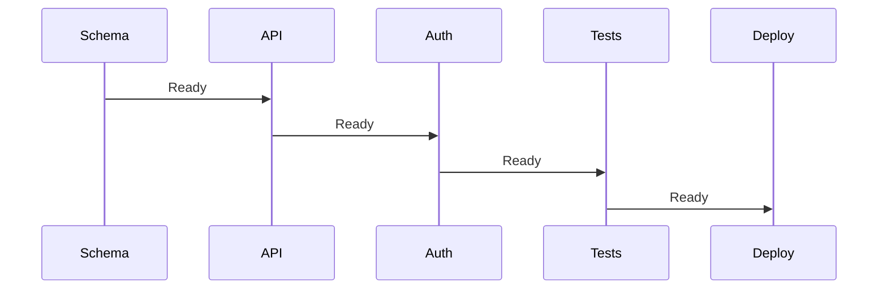
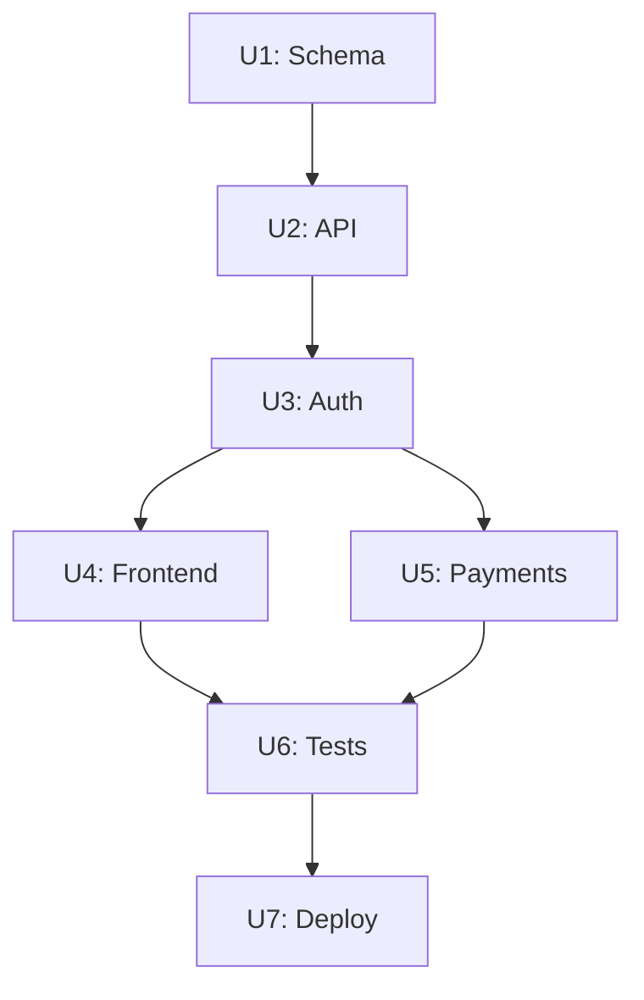
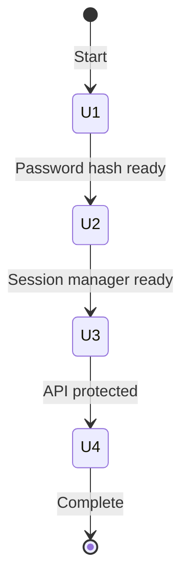

# Mermaid Diagram Guide

This file documents when to generate Mermaid diagrams, which diagram types to use, and how to embed them in the implementation units.

## When to Generate a Diagram

Detect if a diagram would be beneficial:

| Condition                                    | Generate? | Diagram Type |
| -------------------------------------------- | --------- | ------------ |
| 5+ units with simple linear flow             | YES       | Flowchart    |
| 5+ units with complex interdependencies      | YES       | Sequence     |
| Units with state transitions                 | YES       | State        |
| Units with branching logic (if/else)         | YES       | Flowchart    |
| High-risk workflow that needs clarity        | YES       | Sequence     |
| User explicitly asks for diagram             | YES       | User chooses |
| 1-4 units in simple sequence                 | NO        | —            |
| Non-software domain                          | NO        | —            |

**Key principle:** Diagrams are optional visualization aids; they enhance clarity but are not required.

## Diagram Types

### 1. Sequence Diagram

**Best for:** Unit workflow with interactions, dependencies, and sequential flow.

**Use when:**
- Units call other units in a specific order
- There are clear dependency chains
- You want to show parallel vs. sequential execution

**Example:**



**Markdown syntax:**
```markdown

```

### 2. State Diagram

**Best for:** Stateful logic, state transitions, and lifecycle workflows.

**Use when:**
- Units represent states (e.g., "Authenticated", "Validated", "Deployed")
- You want to show state machines or data lifecycle
- There are alternative paths (e.g., success vs. error handling)

**Example:**



**Markdown syntax:**
```markdown

```

### 3. Flowchart

**Best for:** Decision trees, branching logic, and conditional workflows.

**Use when:**
- Units have conditional execution ("if X, then U3; else U4")
- There are alternative paths through the plan
- You want to show decision points

**Example:**



**Markdown syntax:**
```markdown

```

## How to Ask User for Diagram Preference

In Step 7 of `pwrl-plan-design/SKILL.md`:

```
Would you like a Mermaid diagram to visualize the workflow?

Options:
- Yes (Flowchart) — Best for decision trees and conditional logic
- Yes (Sequence) — Best for workflow and dependency chains
- Yes (State diagram) — Best for state transitions and lifecycle
- No — Skip diagram
```

## Embedding Diagrams in Output

Once user selects diagram type, generate and include in the output:

```yaml
# Implementation Units

## Diagram

```mermaid
[generated diagram code here]
```

## Units

### U1: [Unit Name]
...
```

## Diagram Sizing & Clarity

**Guidelines for readable diagrams:**

1. **Keep it simple:** Max 10-15 elements per diagram
2. **Label clearly:** Use descriptive unit names (not just "U1")
3. **Avoid crossing lines:** Reorder units if possible to minimize line crossings
4. **Use spacing:** Leave visual space between diagram elements
5. **Color coding (optional):** Use colors to group related units:
   - 🔵 Backend work
   - 🟢 Frontend work
   - 🟡 Testing/QA
   - 🔴 Deployment

## Examples

### Example 1: Simple Sequence (5 units)

**Diagram type:** Sequence



---

### Example 2: Complex with Branching (7 units)

**Diagram type:** Flowchart



---

### Example 3: State Machine (Auth Flow)

**Diagram type:** State



---

## Limitations & Fallbacks

**If diagram generation fails:**
1. Offer textual alternative:
   ```
   Unit Flow (Text):
   U1 (Create Schema)
     ↓
   U2 (Add API) ←─ U3 (Add Auth)
     ↓              ↓
   U4 (Test) ←─────
   ```
2. Proceed without diagram

**If Mermaid rendering isn't supported:**
1. Provide diagram code in markdown fence
2. Include note: "Diagram requires Mermaid support; view in GitHub or compatible editor"

## Integration Notes

- Diagram generation is optional (Step 7 of `pwrl-plan-design/SKILL.md`)
- Users can decline diagrams
- Diagrams are included in the design units object, then passed to S5 (generate)
- Non-software plans typically skip diagrams
