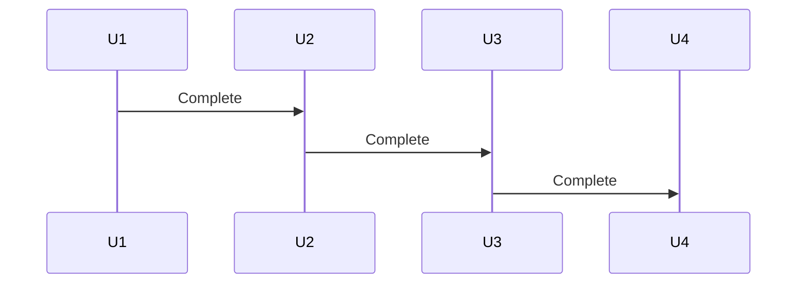
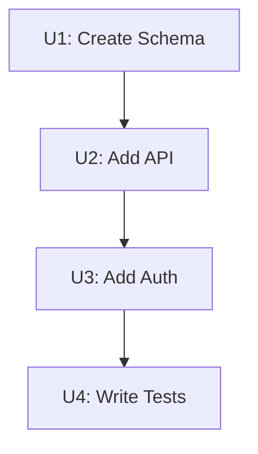

# State Schema — Implementation Units

This file documents the schema and structure of the implementation units object that flows from `pwrl-plan-design` (S4) to `pwrl-plan-generate` (S5).

## Overview

The implementation units object decomposes the work into stable, numbered units (U1, U2, ..., UX), each with defined scope, dependencies, files, approach, and acceptance criteria. It serves as the design specification for the plan generation phase.

## Complete Schema

```yaml
design-id: YYYY-MM-DD-NNN-design
status: complete
complexity_hint: fast | standard | deep

# Implementation Units

## Diagram (Optional)
```mermaid
[optional diagram code]
```

## Units

### U1: [Unit Name]
- **Scope:** [What this unit accomplishes]
- **Dependencies:** [None | U1, U2]
- **Files Affected:**
  - Create: `path/to/new/file`
  - Modify: `path/to/existing/file`
  - Test: `path/to/test/file`
- **Approach:** [Brief technical approach description]
- **Acceptance Criteria:**
  - [Specific condition for completion]
  - [Specific condition for completion]

### U2: [Unit Name]
- **Scope:** [...]
- **Dependencies:** [...]
- **Files Affected:** [...]
- **Approach:** [...]
- **Acceptance Criteria:** [...]
```

## Field Reference

### design-id

**Type:** `string` (format: `YYYY-MM-DD-NNN-design`)
**Required:** Yes
**Description:** Unique identifier for this design session.

**Format:**
- `YYYY-MM-DD`: Today's date (e.g., 2026-06-05)
- `NNN`: Sequential 3-digit number (001, 002, 003...)
- `-design`: Literal suffix

**Example:** `2026-06-05-001-design`

---

### status

**Type:** `string` (enum: `complete` | `pending` | `in-review`)
**Required:** Yes
**Description:** State of the design.

**Values:**
- `complete`: All units defined and confirmed; ready for generation
- `pending`: Design in progress; awaiting confirmation
- `in-review`: Design completed but under review; may change before generation

---

### complexity_hint

**Type:** `string` (enum: `fast` | `standard` | `deep`)
**Required:** Yes
**Description:** Advisor hint on planning tier, based on unit count and risk.

**Determination logic** (from Step 6):

| Unit Count | Risk Level       | Hint       |
| ---------- | ---------------- | ---------- |
| 1-3        | LOW              | fast       |
| 1-3        | HIGH             | standard   |
| 4-8        | any              | standard   |
| 9+         | any              | deep       |

**Advisory nature:** Hint guides tier selection in S5 but can be overridden by user.

---

### Diagram

**Type:** `string` (Mermaid code block) | `null`
**Required:** No (optional)
**Description:** Visual representation of unit workflow and dependencies.

**Format:** Mermaid diagram code (sequence, state, flowchart)

**Guidance:**
- Include if 5+ units with complex dependencies
- Skip if user declines (Step 7)
- Set to `null` if not generated

**Example:**


---

### Units

**Type:** `array` (Unit objects)
**Required:** Yes
**Description:** Ordered list of implementation units.

**Each unit has:**

| Field              | Type     | Required | Description                        |
| ------------------ | -------- | -------- | ---------------------------------- |
| `id`               | string   | yes      | U1, U2, ... UX (stable, no reuse)  |
| `name`             | string   | yes      | Short descriptive name             |
| `scope`            | string   | yes      | What this unit accomplishes        |
| `dependencies`     | string[] | yes      | List of U-IDs this unit depends on |
| `files`            | object   | yes      | Files: create[], modify[], test[]  |
| `approach`         | string   | yes      | High-level technical approach      |
| `acceptance_criteria` | array | yes      | 1-3 specific completion conditions |

---

### Unit: id

**Type:** `string` (format: `U{N}`)
**Required:** Yes
**Description:** Stable, sequential unit identifier.

**Rules:**
- Start at U1, increment by 1 (U1, U2, U3, ...)
- Once assigned, never change or reuse (even if unit deleted)
- If unit deleted, ID is retired (not reassigned)

For details on U-ID stability and retirement, see **[u-id-generator.md](u-id-generator.md)**.

**Example:** `U1`, `U3`, `U5`

---

### Unit: name

**Type:** `string`
**Required:** Yes
**Description:** Short, descriptive name for the unit.

**Guidance:**
- 2-5 words
- Action-oriented (e.g., "Create schema", not "Schema")
- Clear and self-explanatory
- No unit ID in name (ID is in `id` field)

**Examples:**
- ✅ "Create database schema"
- ✅ "Add JWT authentication"
- ✅ "Build REST endpoints"
- ❌ "U1: Create schema" (ID already in `id` field)
- ❌ "stuff" (vague)

---

### Unit: scope

**Type:** `string` (1-2 sentences)
**Required:** Yes
**Description:** What this unit accomplishes; its boundary and purpose.

**Guidance:**
- Clear start and end points
- Deliverables or outcomes
- Scope exclusions (what's NOT in this unit)
- Should be verifiable

**Examples:**
```
"Create the initial PostgreSQL schema with users, products, and orders tables. Include indexes for common queries but not triggers or stored procedures (covered in U3)."

"Add JWT-based authentication middleware. Tokens are validated on every request; refresh mechanism is handled in U6."
```

---

### Unit: dependencies

**Type:** `array` (strings)
**Required:** Yes (may be empty)
**Description:** List of U-IDs this unit depends on (must be completed first).

**Guidance:**
- Empty array `[]` if no dependencies
- List in order (e.g., `["U1", "U2"]` means U1 and U2 must complete first)
- No circular dependencies allowed

**Examples:**
```yaml
Dependencies: []  # No dependencies; can start immediately

Dependencies: ["U1"]  # Depends only on U1

Dependencies: ["U1", "U2"]  # Depends on both U1 and U2
```

---

### Unit: files

**Type:** `object {create, modify, test}`
**Required:** Yes
**Description:** Repository-relative file paths affected by this unit.

**Fields:**
- **create:** Array of new files to create
- **modify:** Array of existing files to modify
- **test:** Array of test files to create or modify

**Format:** Repository-relative paths (e.g., `src/auth/jwt.ts`, not `/home/user/project/...`)

**Examples:**
```yaml
Files Affected:
  Create:
    - src/schema/users.sql
    - src/schema/products.sql
  Modify: []
  Test:
    - tests/schema.test.js
```

```yaml
Files Affected:
  Create:
    - src/middleware/auth.ts
  Modify:
    - src/index.ts  (add middleware)
  Test:
    - tests/auth.test.ts
```

---

### Unit: approach

**Type:** `string` (2-3 sentences)
**Required:** Yes
**Description:** High-level technical approach for implementing this unit.

**Guidance:**
- Directional, not code-level detail
- Should inform design reviews
- No implementation pseudocode (unless very brief)
- Can reference patterns or libraries from research findings

**Examples:**
```
"Use existing JWT validation middleware from `src/middleware/auth.ts`.
Add route protection by wrapping endpoints with `requireAuth()`.
Store refresh tokens in Redis with TTL."
```

```
"Create schema using migrations framework. Add indexes on foreign keys and email
columns for performance. Separate tables for users, products, and orders per
research findings."
```

---

### Unit: acceptance_criteria

**Type:** `array` (strings)
**Required:** Yes
**Description:** 1-3 specific, verifiable conditions that define completion.

**Guidance:**
- Each criterion must be testable
- Should be specific enough to write tests for
- Avoid vague criteria like "works well" or "is complete"
- Include functional, performance, and quality aspects if applicable

**Examples:**
```yaml
Acceptance Criteria:
  - All JWT tokens validated within 1ms per request
  - Refresh mechanism works transparently without user intervention
  - Expired tokens return 401 Unauthorized with clear error message
```

```yaml
Acceptance Criteria:
  - Schema created; all tables present with correct columns and types
  - Indexes on foreign keys and email column present
  - Schema migration is reversible (rollback capability)
```

---

## Versioning

**Current version:** 1.0

**Backward compatibility:** Fields will only be added, never removed or renamed. Downstream skills should handle extra fields gracefully.

---

## Storage and Passing

### Storage Location

Implementation units are typically stored at:

```
docs/plans/.design/YYYY-MM-DD-NNN-design.md
```

This is a markdown file with the YAML frontmatter above as the content.

### Passing to Downstream Skills

The units object is passed to:

1. **S5 (pwrl-plan-generate)** → Uses units to render the final plan

### Storage Example

**File:** `docs/plans/.design/2026-06-05-001-design.md`

```yaml
---
design-id: 2026-06-05-001-design
status: complete
complexity_hint: standard
---

# Implementation Units

## Diagram



## Units

### U1: Create Database Schema
- **Scope:** Create initial PostgreSQL schema with users, products, and orders tables.
- **Dependencies:** None
- **Files Affected:**
  - Create: `migrations/001_initial_schema.sql`
  - Test: `tests/schema.test.js`
- **Approach:** Use migrations framework. Add indexes on foreign keys and email. Reference database-versioning pattern.
- **Acceptance Criteria:**
  - All tables created with correct columns and types
  - Indexes on foreign keys and email present
  - Migration is reversible

### U2: Build REST API Endpoints
- **Scope:** Implement RESTful endpoints for users and products.
- **Dependencies:** ["U1"]
- **Files Affected:**
  - Create: `src/api/users.ts`, `src/api/products.ts`
  - Modify: `src/index.ts`
  - Test: `tests/api.test.js`
- **Approach:** Use Express routing. Follow existing REST patterns. Add request validation.
- **Acceptance Criteria:**
  - GET, POST, PUT, DELETE endpoints working
  - Request validation on all endpoints
  - Response times < 100ms
```

---

## Integration Notes

- **Upstream:** S4 (pwrl-plan-design) produces this schema
- **Downstream:** S5 (generate) consumes units for plan rendering
- **Storage:** `docs/plans/.design/` directory (created on demand)
- **Lifetime:** Units remain available throughout planning; included in final plan
