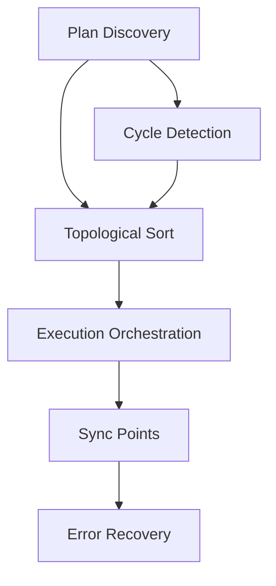

# pwrl-plan-design: Unit Decomposition Algorithm

## Purpose

Define the input/output contracts for the `pwrl-plan-design` micro-skill. This skill:

- Takes scoped context and research findings
- Decomposes work into implementation units (U1, U2, ..., UX)
- Identifies dependencies and risk mitigations
- Returns design artifact for `pwrl-plan-generate`

## Input Contract

### Type: Scope Artifact + Research Artifact (from U1.1 and U1.2)

```yaml
scope-artifact:
  problem_frame: "..."
  success_criteria: [...]
  risk_areas: [...]

research-artifact:
  tech_stack: { ... }
  local_patterns: { ... }
  risk_areas: [...]
  external_research: { ... }
```

### User Context

May prompt user for:

- Confirmation of unit decomposition
- Risk mitigation approaches
- Approval of technical design

## Processing Steps

### 1. Unit Identification

Decompose problem into atomic work units:

```
ALGORITHM:
  units = []

  for each success_criterion in success_criteria:
    work_items = identify_work_items(criterion)
    units.extend(work_items)

  for each risk_area in risk_areas:
    mitigation_units = create_mitigation_units(risk_area)
    units.extend(mitigation_units)

  consolidate_overlapping_units(units)
  return ordered_units
```

Example:

```
Success Criterion: "Multi-plan workflows complete 2x faster"
→ Work Items:
  - U1: Plan discovery algorithm
  - U2: Circular dependency detection
  - U3: Topological sort with parallelization
  - U4: Execution orchestration
  - U5: Atomic sync points

Risk Area: "Atomic commits might fail"
→ Mitigation Units:
  - U6: Rollback procedures
  - U7: Error recovery documentation
```

### 2. Dependency Mapping

Identify dependencies between units:

```
ALGORITHM:
  for each unit U_i:
    dependencies = []
    for each unit U_j (j != i):
      if unit_requires(U_i, U_j):
        dependencies.append(U_j)
    unit.dependencies = dependencies

  return dependency graph G = (V={units}, E={dependencies})
```

Example:

```
U1 (Plan Discovery) → no dependencies
U2 (Cycle Detection) → depends on U1
U3 (Topological Sort) → depends on U1, U2
U4 (Orchestration) → depends on U1, U2, U3
```

### 3. Circular Dependency Detection

Verify no circular dependencies exist:

```
ALGORITHM:
  graph = build_dependency_graph()
  cycles = find_cycles(graph)  // DFS

  if cycles is not empty:
    for each cycle in cycles:
      path = report_cycle_path(cycle)
      PROMPT user: "Circular dependency detected: {path}. Refactor?"
      if user confirms refactor:
        units = refactor_for_cycle_break(units, cycle)
      else:
        ERROR: "Cannot proceed with circular dependencies"
```

Example Error:

```
Circular Dependency Detected:
  U1 (Plan Discovery)
  → U2 (Cycle Detection)
  → U3 (Parallel Execution)
  → U1 (requires plan structure from U1)

RECOVERY: Refactor U3 to break dependency on U1
```

### 4. Risk Mitigation Units

Create units to address identified risks:

```
RISK → MITIGATION UNITS:

Risk: Data Loss
→ U_: Data backup strategy
→ U_: Rollback procedures
→ U_: Data validation tests

Risk: Performance Regression
→ U_: Performance benchmarking
→ U_: Profiling instrumentation

Risk: Security Vulnerability
→ U_: Security review checklist
→ U_: Penetration test cases
```

### 5. Mermaid Diagram Generation (Complex Workflows)

For complex workflows (5+ units with cross-dependencies), generate Mermaid diagram:

```
ALGORITHM:
  if num_units >= 5 AND avg_dependencies > 1:
    generate_dependency_diagram()
    render_as_mermaid_markdown()
```

Example:



### 6. Design Confirmation

Present decomposition to user for approval:

```
PROMPT user:
  "Is this decomposition correct?
   - {num_units} units identified
   - {num_dependencies} dependencies
   - Risk mitigations included: {list}"

  OPTIONS: Approve, Refactor, Add More Detail

  if Approve: PROCEED to step 7
  if Refactor: LOOP back to step 1 with user guidance
  if Add Detail: SPLIT selected unit into sub-units
```

### 7. Compile Design Artifact

Create output artifact with all unit details:

```
ALGORITHM:
  output = {
    units: [
      {
        id: "U1",
        title: "...",
        goal: "...",
        dependencies: ["U0"],
        files: { create: [...], modify: [...], test: [...] },
        test_scenarios: [...],
        acceptance_criteria: [...]
      },
      ...
    ],
    dependency_graph: G,
    risk_mitigations: [...],
    complexity: "HIGH|MEDIUM|LOW",
    estimated_effort: "X units",
    diagram: "mermaid markdown (if complex)"
  }
  return output
```

## Output Contract

### Type: Design Artifact

```yaml
---
format: pwrl-design-artifact
version: "1.0"
created-date: YYYY-MM-DD
created-by: pwrl-plan-design
design-id: YYYY-MM-DD-NNN-design
input-scope-id: YYYY-MM-DD-NNN-scope
input-research-id: YYYY-MM-DD-NNN-research
---

# Implementation Unit Design

## Overview

Brief summary of work decomposition and approach.

Example:
"Cross-plan execution requires 6 core units (discovery, dependency detection, ordering, orchestration, sync, recovery) with linear dependency chain optimized for parallel testing."

## Unit Decomposition

### U1. [Unit Title]

**Goal:** [Clear outcome]

**Dependencies:** None | [List of unit IDs]

**Files:**
- Create: [list of new files]
- Modify: [list of existing files]
- Test: [list of test files]

**Approach:** [How this unit will be implemented]

**Test Scenarios (TDD):**
- **Scenario 1:** [Input] → [Expected Output] ✓
- **Scenario 2:** [Input] → [Expected Output] ✓
- **Scenario 3:** [Edge case] → [Expected Output] ✓

**Acceptance Criteria:**
- Criterion 1 (testable)
- Criterion 2 (measurable)
- Criterion 3 (observable)

### U2. [Unit Title]

[Same structure as U1]

### U3–UX. [Additional Units]

[Repeat pattern]

## Dependency Graph

```

dependency_graph = {
U1: [],
U2: [U1],
U3: [U1, U2],
U4: [U2, U3],
...
}

````

**Graph Visualization:**

```mermaid
graph TD
    U1[U1: Plan Discovery]
    U2[U2: Cycle Detection]
    U3[U3: Topological Sort]
    U4[U4: Orchestration]

    U1 --> U2
    U1 --> U3
    U2 --> U3
    U3 --> U4
````

## Risk Mitigations

### Risk: Atomic Commit Failure

**Mitigation Units:**

- U6: Error Recovery Procedures (how to rollback)
- U7: Test Suite for Failure Scenarios (extensive testing)

**Expected Outcome:** 99%+ commit success rate with clear recovery paths

### Risk: Performance Regression

**Mitigation Units:**

- U8: Performance Benchmarking (establish baselines)
- U9: Profiling Instrumentation (identify bottlenecks)

**Expected Outcome:** No performance regression; maintain 30-50% speedup target

### Risk: Circular Dependencies in Code

**Mitigation Units:**

- U5: Cycle Detection Algorithm (prevent in code)
- U10: Dependency Validation Tests (catch at runtime)

**Expected Outcome:** Zero circular dependencies in production

## Complexity Assessment

**Overall Complexity:** HIGH

- **Unit Count:** 10
- **Dependency Depth:** 4 layers (U1 → U2 → U3 → U4 → ...)
- **Average Dependencies:** 2 per unit
- **Risk Mitigation:** 3 major risk areas with 1-2 units each

**Justification:** Cross-plan orchestration involves multiple algorithms (discovery, cycle detection, topological sort) with coordinated execution and strong error recovery requirements.

## Estimated Effort

- **Total Units:** 10
- **Average Effort per Unit:** 2-4 hours
- **Estimated Total:** 20-40 hours
- **Dependencies:** Sequential phases (can't parallelize much)
- **Testing Overhead:** 30% additional time for TDD

**Breakdown:**

- Phase 1 (Core Algorithms): 15 hours
- Phase 2 (Orchestration): 10 hours
- Phase 3 (Error Recovery): 8 hours
- Phase 4 (Testing): 12 hours
- **Total:** ~45 hours

## Technical Design Notes

### Execution Strategies

1. **INLINE** (1-2 units) — Direct execution, no coordination
2. **SERIAL** (3+ units with dependencies) — Strict ordering
3. **PARALLEL** (3+ independent units) — Concurrent execution
4. **PARALLEL-CROSS-PLAN** (multiple plans) — Group-based orchestration

### Key Decisions

1. **Topological Sort Algorithm:** Kahn's algorithm for deterministic ordering and parallelization group identification
2. **State Passing:** Artifact-based (JSON files) rather than in-memory for auditability and resumability
3. **Error Handling:** Fail-fast with detailed error + recovery suggestions per phase
4. **Rollback Strategy:** All-or-nothing per group (atomic semantics)

## Next Steps

1. **Confirm** this design with stakeholders
2. **Refactor** if circular dependencies or other issues identified
3. **Add Detail** if any unit needs sub-decomposition
4. **Proceed** to pwrl-plan-generate for plan rendering (Fast/Standard/Deep tier)

## Status

**Status:** Ready for Generation Phase

- All units identified and sequenced
- Dependencies validated (no cycles)
- Risk mitigations assigned
- Effort estimated
- Technical decisions documented

```

## Error Cases

### Error: Circular Dependency Detected

```

BEHAVIOR:
cycle_path = [U1, U3, U2, U1]
REPORT: "Circular dependency: U1 → U3 → U2 → U1"
PROMPT: "Refactor to break cycle? Suggest: Move U2 dependency from U1 to U4"

if user approves: refactor_units()
else: ERROR "Cannot proceed with circular dependencies"

```

### Error: Too Many Units (Scope Creep)

```

BEHAVIOR:
if num_units > 15:
WARN: "Design has {num_units} units. Consider breaking into sub-phases?"
PROMPT: "Keep as-is or refactor into logical sub-phases?"
if refactor: consolidate_related_units()

```

### Error: Insufficient Detail

```

BEHAVIOR:
if any unit has no test_scenarios:
PROMPT: "Unit U_X lacks test scenarios. Add detail?"
if yes: split_unit_or_add_scenarios()
else: warn but continue

```

## State Persistence

Design artifact is:
1. Returned to user (in-memory or printed)
2. Optionally persisted to: `docs/plans/.design/YYYY-MM-DD-NNN-design.md`
3. Passed to `pwrl-plan-generate` micro-skill

## Downstream Consumption

Design artifact consumed by:
- **pwrl-plan-generate** — Uses units, dependencies, risk mitigations to generate final plan
- **Future Executors** — Use unit decomposition and dependencies to execute tasks

## Testing Strategy (TDD)

```

Test: "Happy Path: Simple Linear Decomposition"
GIVEN: 3 success criteria (each →1 unit, no risks)
WHEN: design decomposes
THEN: 3 units generated, no dependencies, no cycles

Test: "Circular Dependency Detection"
GIVEN: units with circular references (U1→U2→U1)
WHEN: design identifies cycles
THEN: cycle path reported, error raised

Test: "Risk Mitigation Units"
GIVEN: high-risk areas identified in research
WHEN: design creates mitigations
THEN: mitigation units included in output

Test: "Mermaid Diagram Generation"
GIVEN: 5+ units with 2+ avg dependencies
WHEN: design generates diagram
THEN: diagram renders correctly, all edges present

Test: "Dependency Validation"
GIVEN: units with inter-unit dependencies
WHEN: design validates
THEN: topological order correct, all dependencies satisfied

```

---

**Document Version:** 1.0
**Date:** 2026-06-11
**Status:** Reference specification for U1.3 implementation
```
