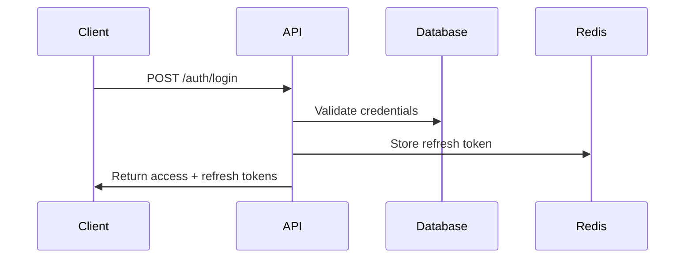

# Render Workflow — Per-Tier Plan Generation

This file documents the detailed rendering logic for each tier (Fast, Standard, Deep) when creating the final plan. It includes section templates, required content for each tier, and guidance on generating tier-specific output.

## Overview

The rendering workflow takes the implementation units from S4 and scoped context/research findings from S2-S3, then produces a complete plan document in Markdown. The sections included and depth of detail vary by tier.

## Sections Present in All Tiers

These sections are required in every plan regardless of tier:

### 1. Frontmatter (YAML)

```yaml
---
id: YYYY-MM-DD-NNN
status: active
tier: Fast | Standard | Deep
created: YYYY-MM-DD
updated: YYYY-MM-DD
---
```

**Fields:**

- `id`: Unique plan identifier
- `status`: "active" (newly created plans are active)
- `tier`: Selected tier
- `created`: Date plan was created
- `updated`: Today's date (updated on each modification)

---

### 2. Title

```markdown
# [Plan Title] (Tier)
```

**Format:** Use the problem statement as the title; append tier name in parentheses.

**Examples:**

- `# Add JWT-Based Authentication to REST API (Standard)`
- `# Migrate from MySQL to PostgreSQL with Zero Downtime (Deep)`

---

### 3. Goal/Overview

```markdown
## Goal

[Problem statement from scoped context]

## Overview

[1-2 sentences summarizing the plan, including key challenges or approach]
```

**Guidance:**

- Use exact language from scoped context's "Problem" field
- Overview should give reader a quick sense of scope and approach

---

### 4. Implementation Units

For each U-ID, render:

```markdown
### U1: [Unit Name]

- **Scope:** [What this unit accomplishes]
- **Dependencies:** [None | U1, U2]
- **Files Affected:**
  - Create: `path/to/new/file`
  - Modify: `path/to/existing/file`
  - Test: `path/to/test/file`
- **Approach:** [Brief technical approach description]
- **Acceptance Criteria:**
  - [Criterion 1]
  - [Criterion 2]
```

**For Standard/Deep tiers add:** Test scenarios per unit (see below)

**For Fast tier add:** Verification per unit (see below)

---

### 5. Related Learnings

```markdown
## Related Learnings

- **[Learning Title]** — `docs/learnings/XXX.md` — [1-line applicability note]

If no learnings: "No relevant learnings found"
```

---

### 6. Learning Gaps

```markdown
## Learning Gaps

- **[Gap Name]** — _Action:_ Document via `/pwrl-learnings` after implementation

If no gaps: "No learning gaps identified at this time"
```

---

## Per-Tier Sections

### Fast Tier Additions

**When to add:** Recommended for 1-3 units with LOW risk

**Additional sections:**

#### Verification (per unit)

Add after "Acceptance Criteria" for each unit:

```markdown
#### U1 Verification

- [ ] Manual test: [specific test]
- [ ] Code review: [specific area]
- [ ] Production test: [specific behavior]
```

---

### Standard Tier Additions

**When to add:** Recommended for 4-8 units or 1-3 units with MEDIUM/HIGH risk

**Additional sections (in order):**

#### Key Technical Decisions

```markdown
## Key Technical Decisions

- **Decision 1 Topic**: [Decision] — _Reason:_ [Rationale from research]
- **Decision 2 Topic**: [Decision] — _Reason:_ [Rationale]
```

**Guidance:** 2-5 key decisions from research findings

---

#### System-Wide Impact

```markdown
## System-Wide Impact

- **API Compatibility:** [Compatibility implications]
- **Security:** [Security implications]
- **Performance:** [Performance implications]
- **State Lifecycle:** [Data/state handling]
```

---

#### Test Scenarios (per unit)

For each unit, add test scenarios:

```markdown
#### U1 Test Scenarios

- **Scenario 1**: [Description] → Expected: [Expected outcome]
- **Scenario 2**: [Description] → Expected: [Expected outcome]
```

**Examples:**

```
- **Scenario 1**: Valid JWT token received → Expected: Token validated; request proceeds
- **Scenario 2**: Expired JWT token received → Expected: Refresh attempted; if successful, request proceeds
```

---

### Deep Tier Additions

**When to add:** Recommended for 9+ units or high-risk workflows

**Additional sections (includes Standard sections plus):**

#### High-Level Technical Design

```markdown
## High-Level Technical Design

> **Note:** This is directional guidance for review, not an implementation specification to copy.

[From S4's diagram, if present: include Mermaid diagram or pseudo-code]

[If no diagram: provide textual design description]
```

**Guidance:**

- Include any Mermaid diagram from S4
- If no diagram: describe data flow, component interactions, system architecture
- Mark as "directional" — not implementation-level code

---

#### Alternative Approaches Considered

```markdown
## Alternative Approaches Considered

- **Approach A**: [Description] → **Rejected because:** [Rationale]
- **Approach B**: [Description] → **Rejected because:** [Rationale]
```

**Guidance:** 1-3 alternatives identified during research; explain why each was rejected

---

#### Risk Analysis & Mitigation

```markdown
## Risk Analysis & Mitigation

| Risk                            | Impact | Mitigation            |
| ------------------------------- | ------ | --------------------- |
| High-risk area 1: [Description] | HIGH   | [Mitigation strategy] |
| High-risk area 2: [Description] | MEDIUM | [Mitigation strategy] |
```

**Guidance:**

- Pull risk details from research findings
- Include specific mitigation actions (code review, testing, monitoring, etc.)
- Use severity: HIGH, MEDIUM, LOW

---

#### Operational & Rollout Notes

```markdown
## Operational & Rollout Notes

**Feature Flags:**

- [Feature flag 1] — [Description and rollout plan]

**Monitoring:**

- [Metric 1] — Alert if [condition]
- [Metric 2] — Alert if [condition]

**Data Migration:**

- [Migration step 1]
- [Migration step 2]

**Rollback Plan:**

- [Rollback step 1]
- [Rollback step 2]

**Performance Baseline:**

- [Current performance metric] → Target: [Target performance]
```

**Guidance:** Include only sections relevant to the plan

---

## Rendering Algorithm

```javascript
function render_plan(tier, context, findings, units, diagram) {
  output = "";

  // All tiers
  output += render_frontmatter(tier, context);
  output += render_title(context);
  output += render_goal_overview(context, tier);
  output += render_units(units, tier, diagram);
  output += render_learnings(context);
  output += render_gaps(context);

  // Standard and Deep
  if (tier in ["standard", "deep"]) {
    output += render_key_decisions(findings);
    output += render_system_impact(findings);
    output += render_test_scenarios(units);
  }

  // Deep only
  if (tier == "deep") {
    output += render_technical_design(units, diagram);
    output += render_alternatives(findings);
    output += render_risk_analysis(findings);
    output += render_rollout_notes(context, units);
  }

  return output;
}
```

---

## Examples

### Fast Tier Plan (3 units)

```markdown
---
id: 2026-06-05-001
status: active
tier: Fast
created: 2026-06-05
updated: 2026-06-05
---

# Add JWT-Based Authentication to REST API (Fast)

## Goal

Add JWT-based authentication to the existing REST API to support third-party integrations.

## Overview

This plan adds JWT tokens with simple validation. Three straightforward units covering token generation, middleware integration, and testing.

### U1: Create JWT Configuration

- **Scope:** Set up JWT configuration with signing keys and expiration rules.
- **Dependencies:** None
- **Files Affected:**
  - Create: `config/jwt-config.js`
  - Modify: `src/index.ts`
- **Approach:** Create simple config with hardcoded signing secret; use existing approach from research.
- **Acceptance Criteria:**
  - Config loads without errors
  - Expiration time is 1 hour (per security policy)

#### U1 Verification

- [ ] Manual test: JWT token generated successfully
- [ ] Code review: Config doesn't expose secrets
- [ ] Production test: Token validation works

### U2: Add Auth Middleware

[... similar format for U2, U3 ...]

## Related Learnings

- docs/learnings/pattern/jwt-authentication.md — Standard JWT flow

## Learning Gaps

None identified
```

---

### Standard Tier Plan (6 units)

```markdown
---
id: 2026-06-05-002
status: active
tier: Standard
created: 2026-06-05
updated: 2026-06-05
---

# Add JWT-Based Authentication to REST API (Standard)

## Goal

Add JWT-based authentication to the existing REST API to support third-party integrations.

## Overview

This plan implements JWT authentication with token refresh, comprehensive error handling, and thorough testing. Six units organized in phases: setup, implementation, testing, and deployment.

[... Units U1-U6 with test scenarios ...]

## Key Technical Decisions

- **Token Storage**: Refresh tokens stored in Redis (not localStorage) — Reason: Better security per research
- **Expiration**: 1-hour access tokens, 7-day refresh tokens — Reason: Security policy balance

## System-Wide Impact

- **API Compatibility**: Existing clients must add Bearer token header
- **Security**: All endpoints now require authentication
- **Performance**: ~1ms validation overhead per request
- **State Lifecycle**: Tokens stored in Redis; cleared on logout

## Related Learnings

- docs/learnings/pattern/jwt-authentication.md
- docs/learnings/gotcha/jwt-expiration-edge-cases.md

[... Learning Gaps ...]
```

---

### Deep Tier Plan (10 units)

````markdown
---
id: 2026-06-05-003
status: active
tier: Deep
created: 2026-06-05
updated: 2026-06-05
---

# Add JWT-Based Authentication to REST API (Deep)

[... Includes all Standard sections plus: ...]

## High-Level Technical Design


````

## Alternative Approaches Considered

- **Approach A: Session-based auth** → Rejected because: Incompatible with stateless API design
- **Approach B: OAuth2** → Rejected because: Overkill for internal auth; JWT simpler

## Risk Analysis & Mitigation

| Risk                 | Impact | Mitigation                                             |
| -------------------- | ------ | ------------------------------------------------------ |
| Token leakage        | HIGH   | Tokens only in memory; HTTPS required; no localStorage |
| Key rotation failure | HIGH   | Automated key rotation every 90 days; staged rollout   |
| Redis unavailability | MEDIUM | Fallback to in-memory cache with TTL                   |

## Operational & Rollout Notes

**Feature Flags:**

- `USE_JWT_AUTH` — Rollout in phases: 10% → 50% → 100%

**Monitoring:**

- `auth_validation_latency` — Alert if > 5ms
- `token_refresh_failures` — Alert if > 0.1% fail rate

**Rollback Plan:**

- Feature flag `USE_JWT_AUTH` → off
- Keep session auth running in parallel for 1 week
- Monitor dual-auth systems for conflicts

```

---

## Integration Notes

- Rendering logic is executed in Step 3 of `pwrl-plan-generate/SKILL.md`
- Tier is selected in Step 1; rendering template chosen in Step 2
- Rendered plan is validated in Step 6 before saving
- Plan file is saved to `docs/plans/YYYY-MM-DD-NNN-<name>.md` in Step 7
```
