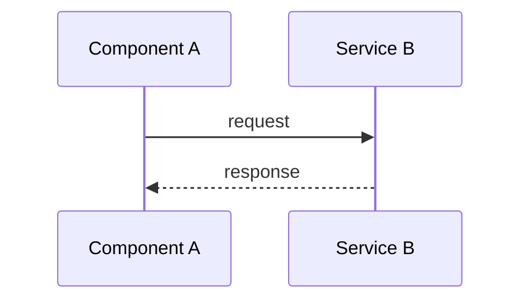

# Plan Templates

This document contains the full templates for the three planning tiers supported by pwrl-plan.

---

## 1. Fast Plan (Lightweight)

**Best for:** Small tweaks, bug fixes, or well-understood tasks.

**When to use:**

- 1-3 files affected
- Clear scope with low ambiguity
- Low risk, straightforward implementation
- No architectural decisions needed

### Template

```markdown
# [Title] (Fast)

**Date:** [YYYY-MM-DD] | **Status:** active

## Goal

[One sentence description of the outcome]

## Implementation Units

- U1. **[Name]**
  - **Files:** `path/to/file`
  - **Approach:** [Brief technical note]
  - **Verification:** [How to confirm it works]

- U2. **[Name]**
  - **Files:** `path/to/file`
  - **Approach:** [Brief technical note]
  - **Verification:** [How to confirm it works]

## Related Learnings

- **[Learning Title]** — `docs/learnings/XXX.md` — [1-line applicability note]
- (List relevant entries from `docs/learnings/INDEX.md`; if none apply, state "No relevant learnings found")

## Learning Gaps

- [Any gap identified during planning that should be documented after implementation via `/pwrl-learnings`]
```

### Example

```markdown
# Add Email Validation to Signup Form (Fast)

**Date:** 2026-05-01 | **Status:** active

## Goal

Validate email format on signup form before submission.

## Implementation Units

- U1. **Add Client-Side Validation**
  - **Files:** `src/components/SignupForm.tsx`
  - **Approach:** Use regex pattern /^[^\s@]+@[^\s@]+\.[^\s@]+$/ on blur event
  - **Verification:** Test with valid and invalid emails; invalid should show error message

- U2. **Add Backend Validation**
  - **Files:** `src/api/auth/signup.ts`
  - **Approach:** Use same regex; return 400 with error message if invalid
  - **Verification:** Test API endpoint with invalid email; should reject with appropriate error
```

---

## 2. Standard Plan (Technical)

**Best for:** Standard feature development and bounded refactors.

**When to use:**

- Multiple files or components
- Technical decisions needed
- Moderate complexity or risk
- Requires test scenarios and validation

### Template

```markdown
# [Title] (Standard)

**Date:** [YYYY-MM-DD] | **Type:** [feat|fix|refactor]

## Overview

[2-4 sentences summarizing the problem frame and context]

## Key Technical Decisions

- **[Decision Topic]**: [Decision made and rationale]
- **[Decision Topic]**: [Decision made and rationale]

## Implementation Units

- U1. **[Unit Name]**
  - **Goal:** [What this unit accomplishes]
  - **Dependencies:** [e.g., None or U2, U3]
  - **Files:**
    - Create: `path/to/new/file`
    - Modify: `path/to/existing/file`
    - Test: `path/to/test/file`
  - **Test Scenarios:**
    - [Happy Path]: [Input -> Expected Outcome]
    - [Edge Case]: [Boundary condition -> Expected Outcome]
    - [Error Case]: [Invalid input -> Expected error handling]

- U2. **[Unit Name]**
  - **Goal:** [What this unit accomplishes]
  - **Dependencies:** [e.g., U1]
  - **Files:**
    - Modify: `path/to/file`
    - Test: `path/to/test`
  - **Test Scenarios:**
    - [Scenario]: [Input -> Expected Outcome]

## System-Wide Impact

[1-3 sentences describing broader effects:]

- State lifecycle considerations
- API compatibility or breaking changes
- Performance implications
- Security considerations

## Related Learnings

- **[Learning Title]** — `docs/learnings/XXX.md` — [1-line applicability note]
- (List relevant entries from `docs/learnings/INDEX.md`; if none apply, state "No relevant learnings found")

## Learning Gaps

- [Any gap identified during planning that should be documented after implementation via `/pwrl-learnings`]
```

### Example

```markdown
# Add Two-Factor Authentication (Standard)

**Date:** 2026-05-01 | **Type:** feat

## Overview

Implement two-factor authentication (2FA) using TOTP (Time-based One-Time Password) to enhance account security. Users can enable 2FA in settings, which requires entering a code from an authenticator app during login.

## Key Technical Decisions

- **TOTP Algorithm**: Use RFC 6238 standard with 30-second time steps and 6-digit codes for compatibility with common authenticator apps (Google Authenticator, Authy)
- **Secret Storage**: Store encrypted TOTP secrets in user profile; use application encryption key
- **Backup Codes**: Generate 10 single-use backup codes per user for account recovery
- **Session Handling**: Require 2FA verification before issuing session token; no changes to existing session duration

## Implementation Units

- U1. **TOTP Secret Generation and QR Code**
  - **Goal:** Allow users to enable 2FA by generating secret and displaying QR code
  - **Dependencies:** None
  - **Files:**
    - Create: `src/api/auth/totp.ts`
    - Create: `src/lib/totp.ts`
    - Create: `src/components/Settings2FA.tsx`
    - Test: `tests/api/auth/totp.test.ts`
  - **Test Scenarios:**
    - Happy Path: User requests 2FA setup → receives secret and QR code URL
    - Validation: User confirms with valid TOTP code → 2FA enabled on profile
    - Error: User submits invalid code → returns error, 2FA not enabled

- U2. **2FA Verification During Login**
  - **Goal:** Require 2FA code after password validation for users with 2FA enabled
  - **Dependencies:** U1
  - **Files:**
    - Modify: `src/api/auth/login.ts`
    - Modify: `src/components/LoginForm.tsx`
    - Test: `tests/api/auth/login-2fa.test.ts`
  - **Test Scenarios:**
    - Happy Path: User with 2FA submits valid password + valid TOTP → receives session token
    - Edge Case: User without 2FA submits password → receives session immediately (no 2FA prompt)
    - Error: User submits valid password but invalid TOTP → login rejected, no session issued
    - Error: TOTP code reuse attempt → rejected (code can only be used once per time window)

- U3. **Backup Codes Generation and Usage**
  - **Goal:** Provide recovery mechanism if user loses authenticator device
  - **Dependencies:** U1
  - **Files:**
    - Modify: `src/api/auth/totp.ts`
    - Modify: `src/api/auth/login.ts`
    - Create: `src/components/BackupCodes.tsx`
    - Test: `tests/api/auth/backup-codes.test.ts`
  - **Test Scenarios:**
    - Happy Path: User enables 2FA → receives 10 backup codes to save
    - Usage: User logs in with backup code → code consumed, cannot be reused
    - Error: User attempts to reuse consumed backup code → login rejected

## System-Wide Impact

- **Session Creation**: Login flow gains an additional verification step for users with 2FA enabled; no impact on users without 2FA
- **Password Reset**: Must disable 2FA during password reset flow to prevent lockout
- **Account Recovery**: Backup codes are the only recovery method; users must save them securely
- **API Changes**: Login endpoint response changes to include `requires_2fa` flag when password validates but 2FA is needed
```

---

## 3. Deep Plan (High-Confidence)

**Best for:** New architecture, migrations, or security-sensitive work.

**When to use:**

- Cross-cutting changes (10+ files)
- Architectural decisions with long-term impact
- High-risk areas (security, payments, data migrations)
- Ambiguous requirements needing alternatives analysis
- Phased rollout or feature flags required

### Template

````markdown
# [Title] (Deep)

**Date:** [YYYY-MM-DD] | **Risk:** [High/Med]

## High-Level Technical Design

> **Note:** This is directional guidance for review, not an implementation specification to copy. The implementation phase will determine specific naming, abstractions, and code structure.

[Provide ONE of these:]

**Mermaid Diagram:**


````

**OR Pseudo-Code Sketch:**

```
on user_action:
  validate input
  if valid:
    process and store
    trigger event
  else:
    return error
```

**OR Data-Flow Map:**

```
User Input → Validation → Processing → Storage → Event Bus → Notification
```

## Implementation Units (Phased)

### Phase 1: Foundation

- U1. **[Unit Name]**
  - **Goal:** [What this unit accomplishes]
  - **Dependencies:** None
  - **Files:**
    - Create: `path/to/file`
    - Test: `path/to/test`
  - **Test Scenarios:**
    - [Scenario]: [Input -> Expected Outcome]

- U2. **[Unit Name]**
  - **Goal:** [What this unit accomplishes]
  - **Dependencies:** U1
  - **Files:**
    - Create: `path/to/file`
  - **Test Scenarios:**
    - [Scenario]: [Input -> Expected Outcome]

### Phase 2: Integration

- U3. **[Unit Name]**
  - **Goal:** [What this unit accomplishes]
  - **Dependencies:** U1, U2
  - **Files:**
    - Modify: `path/to/file`
  - **Test Scenarios:**
    - [Scenario]: [Input -> Expected Outcome]

### Phase 3: Rollout (if applicable)

- U4. **[Unit Name]**
  - **Goal:** [What this unit accomplishes]
  - **Dependencies:** U3
  - **Files:**
    - Modify: `path/to/file`

## Alternative Approaches Considered

- **[Approach Name]**: [Description] → **Rejected because:** [Rationale for not choosing this approach]
- **[Approach Name]**: [Description] → **Rejected because:** [Rationale]

## Risk Analysis & Mitigation

| Risk                        | Impact | Mitigation                                    |
| --------------------------- | ------ | --------------------------------------------- |
| [Specific risk description] | High   | [Concrete step to prevent or recover from it] |
| [Another risk]              | Medium | [Mitigation strategy]                         |

## Operational / Rollout Notes

[Include if applicable:]

- Feature flags: `feature.new_system` controls activation
- Monitoring: Add metrics for [key operations]
- Data migration: [Steps to migrate existing data]
- Rollback plan: [How to safely revert if issues arise]
- Performance baseline: [Expected throughput, latency targets]

## Related Learnings

- **[Learning Title]** — `docs/learnings/XXX.md` — [1-line applicability note]
- (List relevant entries from `docs/learnings/INDEX.md`; if none apply, state "No relevant learnings found")

## Learning Gaps

- [Any gap identified during planning that should be documented after implementation via `/pwrl-learnings`]

````

### Example

```markdown
# Migrate Session Storage from In-Memory to Redis (Deep)

**Date:** 2026-05-01 | **Risk:** High

## High-Level Technical Design

> **Note:** This is directional guidance for review, not an implementation specification to copy.

**Data Flow:**

````

┌─────────────┐ ┌─────────────┐ ┌─────────────┐
│ Request │──────▶│ Session │──────▶│ Redis │
│ with Cookie │ │ Middleware │ │ Storage │
└─────────────┘ └─────────────┘ └─────────────┘
│
▼
┌─────────────┐
│ Application│
│ Handler │
└─────────────┘

```

**Session Lifecycle:**
1. Request arrives with session cookie (JWT)
2. Middleware validates JWT signature and expiration
3. Extract session ID from JWT claims
4. Fetch session data from Redis using session ID as key
5. Attach session object to request context
6. Application handler processes request with session data

**Key Design Points:**
- JWT contains only session ID and expiration (no user data)
- Redis stores full session data with TTL matching JWT expiration
- Session refresh extends both JWT expiration and Redis TTL
- Graceful fallback: if Redis unavailable, reject authentication (fail-closed)

## Implementation Units (Phased)

### Phase 1: Foundation

- U1. **Redis Client and Session Store Interface**
  - **Goal:** Create Redis client wrapper and session storage interface for future swappability
  - **Dependencies:** None
  - **Files:**
    - Create: `src/lib/redis-client.ts`
    - Create: `src/lib/session-store.ts` (interface)
    - Create: `src/lib/session-store-redis.ts` (implementation)
    - Test: `tests/lib/session-store-redis.test.ts`
  - **Test Scenarios:**
    - Happy Path: Store session → retrieve by ID → returns same data
    - TTL: Store session with 1h TTL → wait 1h → session expired and returns null
    - Delete: Store session → delete by ID → retrieve returns null
    - Connection Error: Redis unavailable → operations throw RedisConnectionError

- U2. **Session Middleware Refactor**
  - **Goal:** Abstract session storage in middleware to use SessionStore interface
  - **Dependencies:** U1
  - **Files:**
    - Modify: `src/middleware/session.ts`
    - Test: `tests/middleware/session.test.ts`
  - **Test Scenarios:**
    - Happy Path: Valid JWT → session loaded from store → attached to request
    - Invalid JWT: Malformed or expired JWT → 401 Unauthorized
    - Missing Session: Valid JWT but session not in store → 401 Unauthorized (session invalidated)
    - Store Error: SessionStore throws error → 500 Internal Server Error

### Phase 2: Dual-Write Migration

- U3. **Dual-Write to Both In-Memory and Redis**
  - **Goal:** Write sessions to both stores during migration; read from Redis, fallback to in-memory
  - **Dependencies:** U1, U2
  - **Files:**
    - Create: `src/lib/session-store-dual.ts`
    - Modify: `src/config/session.ts` (enable dual-write mode)
    - Test: `tests/lib/session-store-dual.test.ts`
  - **Test Scenarios:**
    - Happy Path: Create session → written to both stores → readable from Redis
    - Fallback: Redis read fails → falls back to in-memory → succeeds
    - Consistency: Create in dual-write → delete → deleted from both stores

### Phase 3: Cutover to Redis-Only

- U4. **Remove In-Memory Store and Dual-Write**
  - **Goal:** Switch to Redis-only mode after validating migration
  - **Dependencies:** U3 (deployed and stable)
  - **Files:**
    - Modify: `src/config/session.ts` (disable dual-write, use Redis-only)
    - Delete: `src/lib/session-store-memory.ts`
    - Delete: `src/lib/session-store-dual.ts`
  - **Test Scenarios:**
    - Happy Path: All session operations use Redis exclusively
    - No Fallback: In-memory store no longer accessible

### Phase 4: Session Invalidation API

- U5. **Add Admin API for Session Invalidation**
  - **Goal:** Allow admins to invalidate sessions (e.g., logout all sessions for a user)
  - **Dependencies:** U4
  - **Files:**
    - Create: `src/api/admin/sessions.ts`
    - Test: `tests/api/admin/sessions.test.ts`
  - **Test Scenarios:**
    - Happy Path: Admin invalidates session by ID → deleted from Redis → subsequent requests return 401
    - Bulk: Admin invalidates all sessions for user ID → all matching sessions deleted

## Alternative Approaches Considered

- **PostgreSQL for Session Storage**: Use database instead of Redis → **Rejected because:** Session reads are on critical path; Redis provides better latency (<1ms vs ~5-10ms for Postgres). Postgres would also increase database load significantly.

- **Stateless JWT-Only (No Session Store)**: Embed all user data in JWT, no server-side storage → **Rejected because:** Cannot revoke sessions (JWT is valid until expiration). Also increases cookie size significantly (user permissions, roles, etc.).

- **Sticky Sessions with In-Memory**: Keep in-memory sessions but use load balancer sticky sessions → **Rejected because:** Limits horizontal scaling; server restart loses all sessions; no session sharing across services.

## Risk Analysis & Mitigation

| Risk                                | Impact | Mitigation                                                                         |
| ----------------------------------- | ------ | ---------------------------------------------------------------------------------- |
| Redis outage causes total auth loss | High   | Deploy Redis in HA mode (sentinel/cluster). Monitor Redis health; alert on errors. |
| Session data inconsistency          | Medium | Use dual-write phase (Phase 2) to validate; compare in-memory vs Redis for 1 week |
| Performance degradation             | Medium | Benchmark Redis latency; ensure <2ms p99. Use connection pooling.                  |
| Migration causes user logouts       | Medium | Gradual cutover with dual-write; users stay logged in across migration             |

## Operational / Rollout Notes

**Feature Flags:**
- `feature.redis_sessions_dual_write` — Enable Phase 2 (dual-write mode)
- `feature.redis_sessions_only` — Enable Phase 3 (Redis-only mode)

**Monitoring:**
- Add metrics: `redis.session.read_latency`, `redis.session.write_latency`, `redis.connection.errors`
- Alert on: Redis unavailability, latency >10ms p99, connection pool exhaustion

**Data Migration:**
- No explicit migration needed; sessions expire naturally (max 2 weeks TTL)
- During dual-write phase, new sessions automatically populate Redis
- After 2 weeks in dual-write, all active sessions will be in Redis

**Rollback Plan:**
- Phase 2: Disable `redis_sessions_dual_write` flag → revert to in-memory only
- Phase 3: Enable `redis_sessions_dual_write`, disable `redis_sessions_only` → revert to dual-write
- Emergency: Deploy previous version; Redis data persists for future retry

**Performance Baseline:**
- Current: Session read ~0.1ms (in-memory)
- Target: Session read <2ms p99 (Redis)
- Acceptable: <5ms p99; beyond that, investigate Redis performance or network issues
```

---

## Choosing the Right Tier

Use this decision tree to select the appropriate planning tier:

```
Start
  │
  ├─ Is this a small, clear-cut task? (1-3 files, low risk)
  │  └─ YES → Use Fast Plan
  │  └─ NO → Continue
  │
  ├─ Is this cross-cutting, high-risk, or architecturally significant?
  │  (10+ files, new patterns, migrations, security-sensitive)
  │  └─ YES → Use Deep Plan
  │  └─ NO → Continue
  │
  └─ Default → Use Standard Plan
```

**Additional considerations:**

- **Fast → Standard**: Upgrade to Standard if you discover more complexity during planning
- **Standard → Deep**: Upgrade to Deep if risk analysis reveals high impact or multiple viable approaches need evaluation
- **Deep → Standard**: Downgrade to Standard if scope reduces during requirements clarification

**Rule of thumb:**

- Fast: <1 hour to plan, <1 day to implement
- Standard: 1-2 hours to plan, 1-5 days to implement
- Deep: 2-4 hours to plan, 1-3 weeks to implement (often phased)

---

## Template Usage Rules

### Required Sections Per Tier

| Section                          | Fast | Standard | Deep |
| -------------------------------- | :--: | :------: | :--: |
| Goal / Overview                  | ✅   | ✅       | ✅   |
| Implementation Units             | ✅   | ✅       | ✅   |
| Related Learnings                | ✅   | ✅       | ✅   |
| Learning Gaps                    | ✅   | ✅       | ✅   |
| Key Technical Decisions          |      | ✅       | ✅   |
| System-Wide Impact               |      | ✅       | ✅   |
| Test Scenarios (per unit)        |      | ✅       | ✅   |
| High-Level Technical Design      |      |          | ✅   |
| Alternative Approaches           |      |          | ✅   |
| Risk Analysis & Mitigation       |      |          | ✅   |
| Operational / Rollout Notes      |      |          | ✅   |

### File Path Requirements

- All file paths in plans must be **repository-relative** (e.g., `src/main.js`, `docs/plans/YYYY-MM-DD-NNN-name.md`)
- Never use absolute paths (e.g., `/home/user/project/src/main.js`)
- Use backtick inline code formatting for file paths: `` `path/to/file` ``

### Learnings Embedding Rules

- Every plan **must** include a `## Related Learnings` section
- Scan `docs/learnings/INDEX.md` for relevant entries
- Include file path and a 1-line applicability rationale per learning
- If no relevant learnings exist, state: "No relevant learnings found"
- Add a `## Learning Gaps` section for areas where knowledge is missing but needed
- Learning gaps should include a follow-up action to document via `/pwrl-learnings`

### Naming Convention

- Plan files: `docs/plans/YYYY-MM-DD-NNN-<kebab-case-name>.md`
- U-ID format: `U1`, `U2`, ... `UX` (never renumber)
- Frontmatter: `id`, `status`, `tier`, `created`, `updated` fields required
