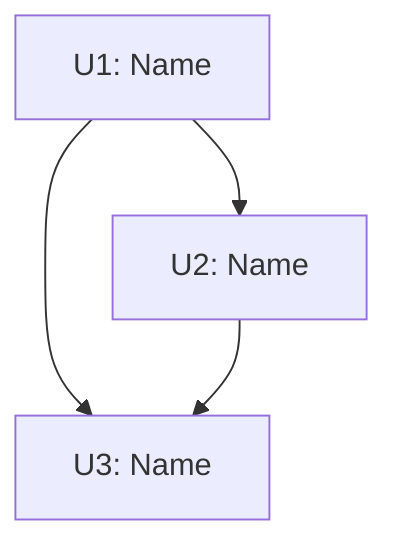

# Task Index Template

This template defines the structure for the `docs/tasks/INDEX.md` file that pwrl-tasks generates to provide an overview of all tasks.

---

## Full INDEX Template

```markdown
# Task Index

**Generated:** YYYY-MM-DD HH:MM
**Source Plan:** [Plan Name](../plans/YYYY-MM-DD-NNN-plan-name.md)
**Total Tasks:** N

## Quick Stats

- **To Do:** N tasks
- **In Progress:** N tasks
- **Done:** N tasks
- **Blocked:** N tasks

## Execution Roadmap

### Critical Path

The longest dependency chain (determines minimum project duration):
```

U1 → U2 → U3 → U5 → U7 (5 tasks)

````

**Estimated Duration:** [If time estimates are available]

### Recommended Starting Tasks

These tasks have no dependencies and can start immediately:

- [U1 - Task Name](to-do/YYYY-MM-DD-u1-task-name.md)
- [U4 - Task Name](to-do/YYYY-MM-DD-u4-task-name.md)
- [U6 - Task Name](to-do/YYYY-MM-DD-u6-task-name.md)

### Parallel Execution Groups

Tasks organized by when they can start:

**Group 1** (Start immediately):
- [U1 - Task Name](to-do/YYYY-MM-DD-u1-task-name.md)
- [U4 - Task Name](to-do/YYYY-MM-DD-u4-task-name.md)

**Group 2** (After Group 1):
- [U2 - Task Name](to-do/YYYY-MM-DD-u2-task-name.md) - depends on U1
- [U5 - Task Name](to-do/YYYY-MM-DD-u5-task-name.md) - depends on U4

**Group 3** (After Group 2):
- [U3 - Task Name](to-do/YYYY-MM-DD-u3-task-name.md) - depends on U2
- [U6 - Task Name](to-do/YYYY-MM-DD-u6-task-name.md) - depends on U4, U5

## All Tasks

### To Do

| Unit ID | Task | Dependencies | Files |
|---------|------|--------------|-------|
| U1 | [Add Email Validation](to-do/YYYY-MM-DD-u1-add-email-validation.md) | None | `src/utils/validators.ts`, `tests/validators.spec.ts` |
| U2 | [Add Client Validation](to-do/YYYY-MM-DD-u2-client-validation.md) | U1 | `src/components/SignupForm.tsx` |
| U3 | [Send Confirmation Email](to-do/YYYY-MM-DD-u3-send-confirmation.md) | U1, U5 | `src/services/email.ts` |

### In Progress

| Unit ID | Task | Dependencies | Files |
|---------|------|--------------|-------|
| - | - | - | - |

*(Empty on initial generation)*

### Done

| Unit ID | Task | Dependencies | Files |
|---------|------|--------------|-------|
| - | - | - | - |

*(Empty on initial generation)*

### Blocked

| Unit ID | Task | Reason | Blocking Issue |
|---------|------|--------|----------------|
| - | - | - | - |

*(Include tasks that couldn't be generated or have unresolved dependencies)*

## Dependency Graph

```mermaid
graph TD
    U1[U1: Add Email Validation]
    U2[U2: Add Client Validation]
    U3[U3: Send Confirmation Email]
    U4[U4: Update README]
    U5[U5: Integrate Email Service]

    U1 --> U2
    U1 --> U3
    U5 --> U3
    U1 --> U4
    U2 --> U4
````

## Task Status

### Status Tracking

Tasks can be tracked by:

1. **File Location**: Move files between `to-do/`, `in-progress/`, `for-review/`, `done/` folders
2. **Frontmatter**: Update `status` field in task file frontmatter

**To move a task to in-progress:**

```bash
mv docs/tasks/to-do/YYYY-MM-DD-u1-task.md docs/tasks/in-progress/
```

Or update frontmatter:

```yaml
status: in-progress
```

**To mark a task complete:**

```bash
mv docs/tasks/in-progress/YYYY-MM-DD-u1-task.md docs/tasks/done/
```

Or update frontmatter:

```yaml
status: done
```

### Updating This Index

This index should be regenerated when:

- Tasks move between status folders
- Dependencies change
- New tasks are added or removed

**Regenerate command:**

```bash
# Run pwrl-tasks again or manually update this file
```

## Notes

[Any additional notes about the task breakdown, caveats, or clarifications]

---

**Last Updated:** YYYY-MM-DD HH:MM

````

---

## Minimal INDEX Template (for simple task sets)

For projects with fewer than 5 tasks or simple linear dependencies:

```markdown
# Task Index

**Source Plan:** [Plan Name](../plans/YYYY-MM-DD-plan-name.md)
**Generated:** YYYY-MM-DD

## Tasks

1. [U1 - Task Name](to-do/YYYY-MM-DD-u1-task-name.md)
2. [U2 - Task Name](to-do/YYYY-MM-DD-u2-task-name.md) - depends on U1
3. [U3 - Task Name](to-do/YYYY-MM-DD-u3-task-name.md) - depends on U2

**Recommended order:** U1 → U2 → U3

---

**Status:**
- To Do: 3
- In Progress: 0
- Done: 0
````

---

## Template Components

### Critical Path Section

Shows the longest dependency chain:

```markdown
### Critical Path
```

U1 → U2 → U5 → U7

```

This is the minimum number of sequential tasks. The project cannot complete faster than this chain.
```

**Purpose:** Helps estimate project duration and identify bottlenecks.

### Parallel Execution Groups

Shows which tasks can run simultaneously:

```markdown
### Parallel Execution Groups

**Group 1** (Start now):

- U1, U4, U6 (no dependencies)

**Group 2** (After U1):

- U2 (needs U1), U5 (needs U1)

**Group 3** (After U2 and U5):

- U3 (needs U2, U5)
```

**Purpose:** Enables parallel development by multiple developers or work sessions.

### Dependency Graph (Mermaid)

Visual representation of task relationships:

````markdown
## Dependency Graph


````

````

**Purpose:** Visual understanding of dependencies, helpful for planning and communication.

**Mermaid Tips:**
- Use `TD` (top-down) or `LR` (left-right) layout
- Keep node labels concise
- Use `-->` for dependencies
- Consider using `subgraph` for grouping related tasks

### Task Status Table

Organized view of all tasks:

```markdown
## All Tasks

### To Do

| Unit ID | Task | Dependencies | Files |
|---------|------|--------------|-------|
| U1 | [Name](to-do/file.md) | None | `file.ts` |
| U2 | [Name](to-do/file.md) | U1 | `file.ts` |
````

**Purpose:** Quick reference for task details and status.

---

## Generation Logic

### Step 1: Collect Task Information

```typescript
interface TaskInfo {
  unitId: string;
  name: string;
  filePath: string;
  dependencies: string[];
  files: string[];
  status: "to-do" | "in-progress" | "for-review" | "done" | "blocked";
}

function collectTasks(): TaskInfo[] {
  // Scan docs/tasks/ folders
  // Parse frontmatter from each task file
  // Return array of task info
}
```

### Step 2: Calculate Dependencies

```typescript
function calculateMetrics(tasks: TaskInfo[]) {
  return {
    criticalPath: findCriticalPath(tasks),
    parallelGroups: findParallelGroups(tasks),
    startableTasks: tasks.filter((t) => t.dependencies.length === 0),
    totalByStatus: countByStatus(tasks),
  };
}
```

### Step 3: Generate Mermaid Graph

```typescript
function generateMermaidGraph(tasks: TaskInfo[]): string {
  let graph = "graph TD\n";

  // Add nodes
  for (const task of tasks) {
    const label = `${task.unitId}: ${task.name}`;
    graph += `    ${task.unitId}[${label}]\n`;
  }

  // Add edges
  for (const task of tasks) {
    for (const dep of task.dependencies) {
      graph += `    ${dep} --> ${task.unitId}\n`;
    }
  }

  return graph;
}
```

### Step 4: Format Tables

```typescript
function generateStatusTable(tasks: TaskInfo[], status: string): string {
  const filtered = tasks.filter((t) => t.status === status);

  let table = "| Unit ID | Task | Dependencies | Files |\n";
  table += "|---------|------|--------------|-------|\n";

  for (const task of filtered) {
    const deps =
      task.dependencies.length > 0 ? task.dependencies.join(", ") : "None";
    const files = task.files.map((f) => `\`${f}\``).join(", ");

    table += `| ${task.unitId} | [${task.name}](${task.filePath}) | ${deps} | ${files} |\n`;
  }

  return table;
}
```

---

## Best Practices

1. **Keep it Current**: Regenerate INDEX when tasks change status
2. **Visual Aids**: Always include dependency graph for clarity
3. **Actionable Info**: Highlight what can be worked on now
4. **Links Work**: Verify all task file links are correct
5. **Right-size**: Use minimal template for simple projects

---

## Integration with pwrl-work

The INDEX file serves multiple purposes for pwrl-work:

1. **Discovery**: pwrl-work can scan INDEX to find next available task
2. **Validation**: Check if dependencies are satisfied before starting a task
3. **Progress Tracking**: Update INDEX as tasks complete
4. **Parallel Execution**: Use parallel groups to distribute work

**Example pwrl-work invocation:**

```bash
# Start next available task
/pwrl-work --auto-select-from docs/tasks/INDEX.md

# Start specific task
/pwrl-work docs/tasks/to-do/2026-05-04-u1-add-email-validation.md
```

---

## Update Workflow

When should INDEX be updated?

### Automatic Updates

pwrl-tasks should regenerate INDEX:

- After initial task generation
- When re-slicing a plan with new units

### Manual Updates

Developers should update INDEX:

- When moving tasks between status folders
- When marking tasks complete
- When dependencies change during implementation

### Partial Updates

For quick status changes without full regeneration:

```bash
# Script to update just the status tables
./scripts/update-task-index.sh
```

(Note: This script would be created separately if needed)

---

## Anti-patterns

❌ **Outdated INDEX**: Not updating when tasks change status
❌ **Broken Links**: Task file paths in INDEX don't match actual locations
❌ **Missing Critical Path**: Not showing the longest dependency chain
❌ **No Visual Graph**: Omitting Mermaid diagram for complex projects
❌ **Too Much Detail**: Including implementation details instead of just metadata
